# 🏗️ Architecture

The Advanced MCP Client is built on a revolutionary architecture designed for intelligent orchestration and massively parallel execution. This section provides a deep dive into how the system works.

## 🧠 Central Governor: The Decision Engine

The **Central Governor** is the intelligent heart of the Advanced MCP Client, acting as a strategic orchestrator that continuously monitors, analyzes, and optimizes system performance.

### Governor Core Functions

#### 🔍 System Intelligence & Monitoring
- **Real-time State Analysis**: Continuously monitors all active tasks, resource utilization, and system performance
- **Context Awareness**: Understands the broader conversation goal and how each task contributes
- **Performance Pattern Recognition**: Learns from execution patterns to predict optimal scheduling
- **Bottleneck Detection**: Identifies performance constraints before they impact user experience

#### 🎛️ Dynamic Control & Optimization
- **Task Prioritization**: Dynamically adjusts task priorities based on user context and resource availability
- **Resource Reallocation**: Intelligently redistributes CPU, memory, and thread resources
- **Execution Control**: Can pause, reschedule, halt, or reprioritize operations based on changing conditions
- **Quality Assurance**: Validates task results against conversation context for relevance and accuracy

### Governor Decision Process

## 🧵 Thread Pool Architecture

The Advanced MCP Client uses a sophisticated thread management system for optimal parallel execution:

```mermaid
graph TB
    subgraph TML["📋 Task Management Layer"]
        TS[🎯 Task Scheduler<br/>Priority Queue]
        PS[⚖️ Priority System<br/>High/Med/Low]
        DS[🔗 Dependency Resolver<br/>Task Dependencies]
    end

    subgraph TPL["🧵 Thread Pool Layer"]
        T1[🟢 Thread 1<br/>Status: Idle<br/>Last: Weather API]
        T2[🔴 Thread 2<br/>Status: Busy<br/>Current: Data Analysis]
        T3[🟢 Thread 3<br/>Status: Idle<br/>Last: Email Send]
        T4[🔴 Thread 4<br/>Status: Busy<br/>Current: File Processing]
    end

    subgraph MTL["🔧 MCP Tools Layer"]
        MT1[🌤️ Weather Service<br/>External API]
        MT2[📊 Analytics Engine<br/>Data Processing]
        MT3[📧 Email System<br/>SMTP Service]
        MT4[🔍 Search Service<br/>Database Query]
    end

    TS --> T1
    TS --> T3
    PS --> TS
    DS --> TS

    T2 --> MT2
    T4 --> MT1

    style TS fill:#bbdefb,stroke:#1976d2,stroke-width:3px,color:#000
    style PS fill:#c8e6c9,stroke:#2e7d32,stroke-width:2px,color:#000
    style DS fill:#ffe0b3,stroke:#f57c00,stroke-width:2px,color:#000
    style T1 fill:#c8e6c9,stroke:#2e7d32,stroke-width:2px,color:#000
    style T2 fill:#ffcccb,stroke:#d32f2f,stroke-width:2px,color:#000
    style T3 fill:#c8e6c9,stroke:#2e7d32,stroke-width:2px,color:#000
    style T4 fill:#ffcccb,stroke:#d32f2f,stroke-width:2px,color:#000
```

### Dynamic Thread Scaling

The thread pool automatically adjusts based on:
- **System Load**: More threads when CPU is available
- **Task Complexity**: Heavier threads for compute-intensive tasks
- **Resource Constraints**: Throttling to prevent system overload
- **Governor Decisions**: Intelligent allocation based on priorities

## 🔄 Execution Flow Transformation

### Traditional vs Advanced Parallel Flow

```mermaid
graph TD
    U[👤 User Input] --> L[🤖 LLM Analysis]
    L --> T1[🔧 Tool 1<br/>Execute & Wait]
    T1 --> T2[🔧 Tool 2<br/>Execute & Wait]
    T2 --> T3[🔧 Tool 3<br/>Execute & Wait]
    T3 --> R[📤 Response<br/>Sum of all times]
    
    style U fill:#ffcccb,stroke:#d32f2f,stroke-width:2px,color:#000
    style R fill:#ffcccb,stroke:#d32f2f,stroke-width:2px,color:#000
    style T1 fill:#ffe0b3,stroke:#f57c00,stroke-width:2px,color:#000
    style T2 fill:#ffe0b3,stroke:#f57c00,stroke-width:2px,color:#000
    style T3 fill:#ffe0b3,stroke:#f57c00,stroke-width:2px,color:#000
```

<h4 className="text-red-600 font-semibold mb-3">🐌 Traditional Sequential</h4>

<h4 className="text-green-600 font-semibold mb-3">⚡ Advanced Parallel</h4>

```mermaid
graph TD
    U[👤 User Input] --> L[🤖 LLM Analysis]
    L --> G[🧠 Central Governor<br/>Context Analysis & Planning]
    G --> S[📋 Task Scheduler<br/>Priority Assignment]
    S --> P[🧵 Thread Pool<br/>Resource Allocation]
    
    P --> T1[🔧 Tool 1<br/>Monitored Execution]
    P --> T2[🔧 Tool 2<br/>Monitored Execution]
    P --> T3[🔧 Tool 3<br/>Monitored Execution]
    
    T1 --> A[📊 Result Aggregator<br/>Governor Validation]
    T2 --> A
    T3 --> A
    A --> R[📤 Optimized Response<br/>Quality Assured]
    
    style U fill:#c8e6c9,stroke:#2e7d32,stroke-width:2px,color:#000
    style G fill:#fff9c4,stroke:#f57f17,stroke-width:4px,color:#000
    style R fill:#c8e6c9,stroke:#2e7d32,stroke-width:2px,color:#000
    style P fill:#ffe0b3,stroke:#f57c00,stroke-width:3px,color:#000
```

## 💾 Context Management System

### Dynamic Shared Context

The Advanced MCP Client maintains a sophisticated context system that enables intelligent coordination:

### Context Features

- **Real-time Updates**: All components receive live context changes
- **Structured Data**: Semantic relationships and intelligent queries
- **Concurrency Safe**: Robust mechanisms prevent data corruption
- **Scoped Access**: Agents receive relevant context only
- **Persistent Memory**: Context survives across sessions

## ⏰ Advanced Scheduling System

The scheduler supports diverse trigger mechanisms and intelligent prioritization:

### Scheduling Capabilities

- **Multi-level Priorities**: High, medium, low with dynamic adjustment
- **Complex Dependencies**: DAG-based workflow management
- **Resource Awareness**: CPU, memory, and API limit consideration
- **Fault Tolerance**: Automatic retry and error recovery
- **Real-time Adaptation**: Dynamic reprioritization based on conditions

## 🛡️ Security & Permissions

### Intelligent Permissions UX

The Advanced MCP Client revolutionizes security by making it context-aware and user-friendly:

### Security Features

- **Context-Aware Access**: Permissions based on task nature and environment
- **JIT Access**: Temporary permissions with automatic expiration
- **Risk-Based Escalation**: Only high-risk operations require user interaction
- **Zero Trust Model**: Every request verified, no implicit trust
- **Transparent Audit**: Complete visibility into all security decisions

## 🎯 System Integration

### MCP Protocol Compliance

The Advanced MCP Client maintains full compatibility with the Model Context Protocol:

- **Standard Interface**: All MCP message types supported
- **Tool Discovery**: Automatic detection and integration
- **Multi-provider Support**: Works with OpenAI, Anthropic, and others
- **Streaming Support**: Efficient handling of real-time responses

### LLM Integration Architecture

## 📊 Performance Monitoring

### Real-time Metrics

The system provides comprehensive monitoring of:

- **Thread Utilization**: Active threads and queue lengths
- **Task Performance**: Execution times and success rates
- **Resource Usage**: CPU, memory, and network consumption
- **Governor Decisions**: Decision history and optimization impact
- **Error Rates**: Failure patterns and recovery success

### Optimization Insights

The Governor continuously analyzes performance data to provide:

- **Bottleneck Identification**: Where the system is constrained
- **Resource Recommendations**: Optimal thread pool sizing
- **Scheduling Improvements**: Better task prioritization
- **Configuration Tuning**: System parameter optimization

---

This architecture enables the Advanced MCP Client to deliver unprecedented performance while maintaining reliability, security, and ease of use. The Central Governor ensures that all components work together intelligently to achieve optimal results.