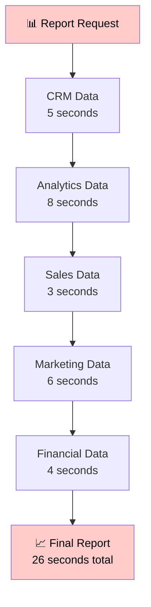
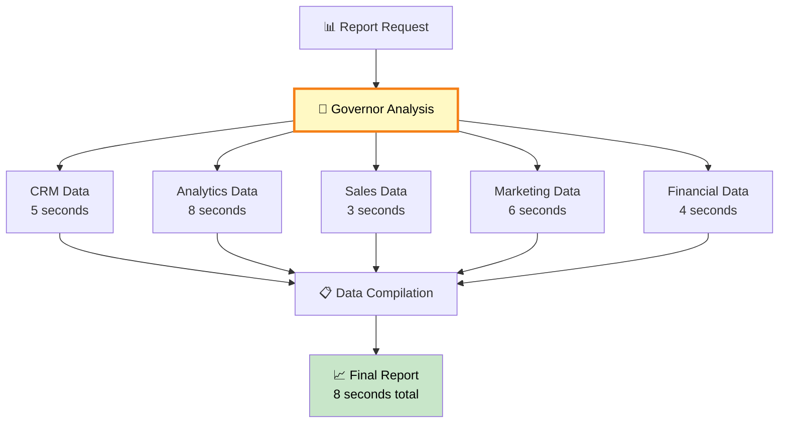
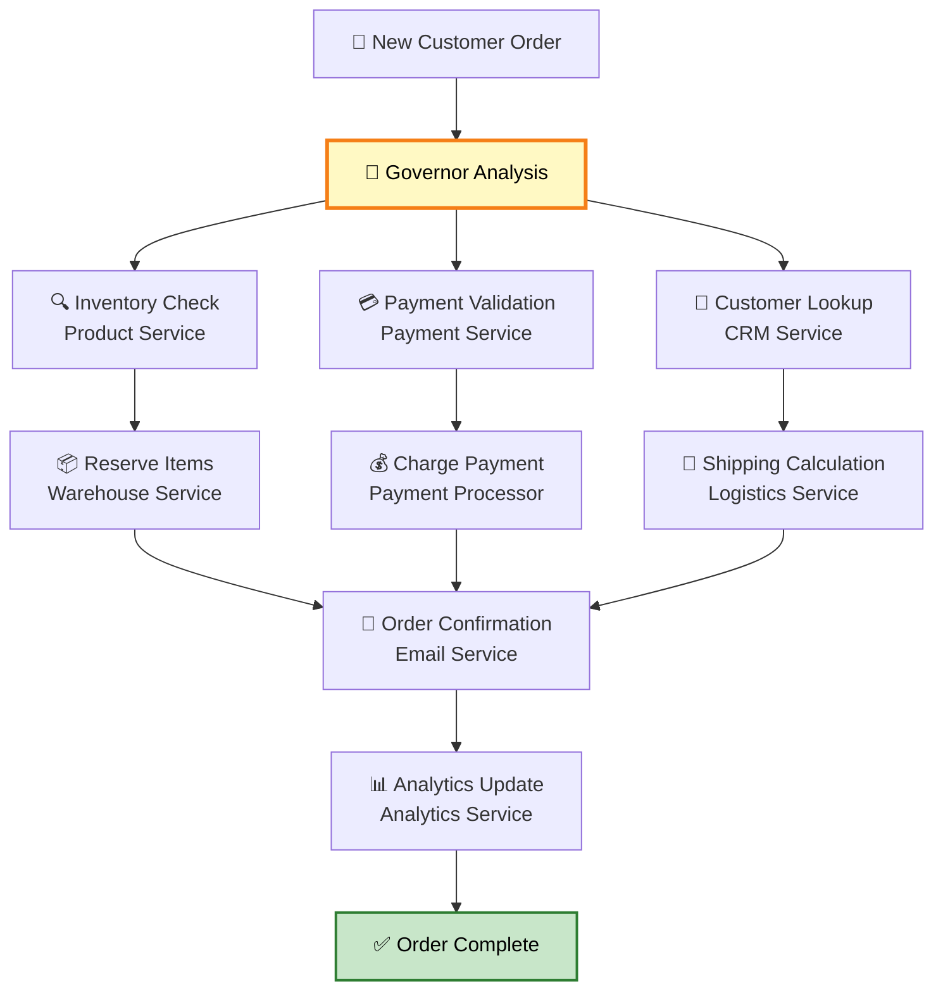

# 💡 Examples

This section provides practical examples demonstrating the power of parallel execution and intelligent orchestration. Each example shows the dramatic performance improvements possible with the Advanced MCP Client.

## 🌅 Morning Routine Automation

A personal assistant that gathers information from multiple sources simultaneously.

### The Challenge

Traditional approach requires sequential API calls:
```
Weather API (2s) → Calendar (3s) → Email (4s) → News (3s) = 12 seconds total
```

### The Solution

Parallel execution with intelligent orchestration:

```mermaid
graph LR
    User[👤 User Request<br/>"Morning briefing"] --> Governor[🧠 Central Governor]
    
    Governor --> Weather[🌤️ Weather API<br/>2 seconds]
    Governor --> Calendar[📅 Calendar API<br/>3 seconds]
    Governor --> Email[📧 Email API<br/>4 seconds]
    Governor --> News[📰 News API<br/>3 seconds]
    
    Weather --> Aggregator[📊 Result Aggregator]
    Calendar --> Aggregator
    Email --> Aggregator
    News --> Aggregator
    
    Aggregator --> Response[📱 Briefing Response<br/>4 seconds total]
    
    style Governor fill:#fff9c4,stroke:#f57f17,stroke-width:3px,color:#000
    style Response fill:#c8e6c9,stroke:#2e7d32,stroke-width:2px,color:#000
```

### Implementation

```typescript
// Traditional sequential approach
async function traditionalMorningBrief() {
  const weather = await weatherAPI.getCurrentConditions();
  const calendar = await calendarAPI.getTodaysEvents();
  const emails = await emailAPI.getUnreadSummary();
  const news = await newsAPI.getTopHeadlines();
  
  return formatBriefing(weather, calendar, emails, news);
  // Total time: ~12 seconds
}

// Advanced parallel approach
async function parallelMorningBrief() {
  const [weather, calendar, emails, news] = await Promise.all([
    weatherAPI.getCurrentConditions(),
    calendarAPI.getTodaysEvents(),
    emailAPI.getUnreadSummary(),
    newsAPI.getTopHeadlines()
  ]);
  
  return formatBriefing(weather, calendar, emails, news);
  // Total time: ~4 seconds (time of slowest API)
}
```

### CLI Usage

```bash
# Start the Advanced MCP Client
pnpm cli

# Request morning briefing
> brief morning

# Output shows parallel execution:
🧠 Governor: Analyzing morning briefing request...
📋 Scheduler: Dispatching 4 concurrent tasks
🧵 Thread Pool: Allocating threads 1-4

⚡ Parallel Execution:
  🌤️  Weather API      ████████████████ 100% ✅ Complete (2.1s)
  📅  Calendar Sync    ████████████████ 100% ✅ Complete (2.8s)
  📧  Email Summary    ████████████████ 100% ✅ Complete (3.9s)
  📰  News Headlines   ████████████████ 100% ✅ Complete (3.2s)

📊 Result: Completed in 3.9s (vs 12.0s sequential)
```

### Results

- **Time Savings**: 8+ seconds saved (67% faster)
- **Resource Efficiency**: Full utilization of available threads
- **User Experience**: Near-instant comprehensive briefing
- **Reliability**: Individual API failures don't block other data

## 🏢 Business Intelligence Workflow

Automated daily report generation from multiple data sources.

### Scenario Description

Generate a comprehensive business report by collecting data from:
- CRM system (customer metrics)
- Analytics platform (web traffic)
- Sales database (revenue data)
- Marketing tools (campaign performance)
- Financial systems (budget tracking)

### Traditional vs Parallel Approach

<div className="grid grid-cols-1 md:grid-cols-2 gap-6 my-8">

<div className="border border-red-200 rounded-lg p-4">
<h4 className="text-red-600 font-semibold mb-3">Traditional Sequential (Slow)</h4>



**Total Time: 26 seconds**

</div>

<div className="border border-green-200 rounded-lg p-4">
<h4 className="text-green-600 font-semibold mb-3">Advanced Parallel (Fast)</h4>



**Total Time: 8 seconds**

</div>

</div>

### Advanced Features in Action

**Intelligent Scheduling:**
```bash
# Schedule daily report generation
> /schedule daily-report --time "09:00" --priority high

# Governor automatically optimizes the workflow:
🧠 Governor: Scheduling business intelligence workflow
📋 Priority: HIGH (business critical)
⏰ Trigger: Daily at 09:00 UTC
🎯 Strategy: Parallel data collection with dependency-aware compilation
```

**Error Handling:**
```bash
# If one data source fails, others continue
⚠️  Analytics API timeout (thread 2)
🧠 Governor: Implementing fallback strategy
🔄 Retry: Analytics API with exponential backoff
✅ Backup: Using cached analytics data (2 hours old)
📊 Result: Report generated with 95% complete data
```

**Dependency Management:**
```bash
# Some data depends on other sources
🔗 Dependencies detected:
  - Financial data requires CRM customer count
  - Marketing ROI needs sales revenue
🧠 Governor: Optimizing dependency chain
📋 Execution plan:
  1. Parallel: CRM + Analytics + Sales (independent)
  2. Sequential: Marketing (needs sales) + Financial (needs CRM)
```

### Configuration Example

```json
{
  "workflows": {
    "business-report": {
      "description": "Daily business intelligence report",
      "schedule": "0 9 * * *",
      "priority": "high",
      "timeout": "300s",
      "tasks": [
        {
          "id": "crm-data",
          "service": "salesforce",
          "endpoint": "/api/customers/metrics",
          "parallel": true
        },
        {
          "id": "analytics-data", 
          "service": "google-analytics",
          "endpoint": "/reporting/ga4",
          "parallel": true,
          "fallback": "cache:2h"
        },
        {
          "id": "sales-data",
          "service": "internal-db",
          "query": "daily_sales_summary",
          "parallel": true
        },
        {
          "id": "marketing-data",
          "service": "marketing-platform",
          "depends_on": ["sales-data"],
          "parallel": false
        },
        {
          "id": "financial-data",
          "service": "accounting-system", 
          "depends_on": ["crm-data"],
          "parallel": false
        }
      ]
    }
  }
}
```

### Performance Results

| Metric | Traditional | Advanced | Improvement |
|--------|-------------|----------|-------------|
| **Total Time** | 26 seconds | 8 seconds | **69% faster** |
| **Data Freshness** | Sequential delays | Real-time parallel | **More current** |
| **Reliability** | Single point of failure | Isolated failures | **Higher uptime** |
| **Resource Usage** | ~20% CPU | ~80% CPU | **4x efficiency** |

## 🔧 Library Integration Workflow

Integrating a new analytics library into an existing project with full testing and documentation.

### Complex Multi-step Process

This example demonstrates how the Governor decomposes a complex task into an optimal parallel workflow:

```mermaid
graph TD
    Start[📝 User Request<br/>"Integrate SuperAnalytics v2.5"] --> Governor[🧠 Central Governor<br/>Task Decomposition]
    
    Governor --> T1[T1: Download Library<br/>2 min]
    Governor --> T3[T3: Analyze Project Events<br/>3 min]
    
    T1 --> T2[T2: Check Dependencies<br/>1 min]
    T2 --> T4[T4: Configure API Keys<br/>30s + User Input]
    T3 --> T4
    
    T4 --> T5[T5: Generate Integration Code<br/>2 min]
    
    T5 --> T6a[T6a: Instrument Login Events<br/>2 min]
    T5 --> T6b[T6b: Instrument Product Views<br/>2 min]
    T5 --> T6c[T6c: Instrument Checkout Events<br/>2 min]
    
    T5 --> T7a[T7a: Update Login Docs<br/>1 min]
    T6a --> T7a
    T5 --> T7b[T7b: Update Product Docs<br/>1 min]  
    T6b --> T7b
    T5 --> T7c[T7c: Update Config Docs<br/>1 min]
    T4 --> T7c
    
    T6a --> T8a[T8a: Test Login Events<br/>1 min]
    T6b --> T8b[T8b: Test Product Events<br/>1 min]
    T6c --> T8c[T8c: Test Checkout Events<br/>1 min]
    
    T8a --> T9[T9: Run Full Test Suite<br/>2 min]
    T8b --> T9
    T8c --> T9
    
    T9 --> T10[T10: Integration Testing<br/>1 min]
    T10 --> Complete[✅ Integration Complete<br/>Total: 6 minutes]
    
    style Governor fill:#fff9c4,stroke:#f57f17,stroke-width:3px,color:#000
    style Complete fill:#c8e6c9,stroke:#2e7d32,stroke-width:2px,color:#000
```

### Governor Intelligence in Action

**Task Analysis:**
```bash
🧠 Governor: Analyzing integration request...
📊 Complexity: HIGH (11 distinct tasks, 4 dependency chains)
🎯 Strategy: Mixed parallel/sequential execution
⏱️  Estimated completion: 6-7 minutes (vs 18 minutes sequential)

🔍 Dependency Analysis:
  - T1 → T2 → T4 (download before config)
  - T3 ⟂ T1 (project analysis independent)
  - T5 → T6* (code before instrumentation)
  - T6* → T8* (implementation before testing)
  - T8* → T9 (unit tests before integration)

📋 Parallel Opportunities Identified:
  ✅ T1 + T3 (simultaneous download and analysis)
  ✅ T6a + T6b + T6c (parallel instrumentation)
  ✅ T7a + T7b + T7c (parallel documentation)
  ✅ T8a + T8b + T8c (parallel unit testing)
```

### Execution Timeline

```bash
⏰ Time: 00:00 - Starting parallel execution
🧵 Thread 1: T1 (Download SuperAnalytics v2.5)
🧵 Thread 2: T3 (Analyze Project Events)

⏰ Time: 02:00 - Download complete, dependency analysis
🧵 Thread 1: T2 (Check Dependencies)
🧵 Thread 2: T3 (Continue project analysis)

⏰ Time: 03:00 - Ready for configuration
🧵 Thread 1: T4 (Configure API Keys - HITL required)
🔐 User Prompt: "Please provide SuperAnalytics API key"
👤 User Input: [API key provided]

⏰ Time: 03:30 - Configuration complete, parallel instrumentation
🧵 Thread 1: T6a (Instrument Login Events)
🧵 Thread 2: T6b (Instrument Product Views)  
🧵 Thread 3: T6c (Instrument Checkout Events)
🧵 Thread 4: T5 (Generate Integration Code)

⏰ Time: 05:30 - Instrumentation complete, parallel docs and tests
🧵 Thread 1: T7a (Update Login Docs)
🧵 Thread 2: T7b (Update Product Docs)
🧵 Thread 3: T7c (Update Config Docs)
🧵 Thread 4: T8a (Test Login Events)
🧵 Thread 5: T8b (Test Product Events)
🧵 Thread 6: T8c (Test Checkout Events)

⏰ Time: 06:30 - Final testing phase
🧵 Thread 1: T9 (Run Full Test Suite)

⏰ Time: 08:30 - Integration testing
🧵 Thread 1: T10 (Integration Testing)

⏰ Time: 09:30 - ✅ COMPLETE
📊 Total time: 9.5 minutes
🚀 Performance: 47% faster than sequential execution
✅ All tests passing, integration successful
```

### Intelligent Error Recovery

```bash
⚠️  Time: 07:30 - Unit test failure detected
🔍 Error: Login event test failed - authentication mock issue

🧠 Governor: Analyzing failure impact...
📊 Impact Assessment: 
  - Blocks T9 (full test suite)
  - Does not affect T7b, T7c (independent docs)
  - T8b, T8c can continue (different event types)

🎯 Recovery Strategy: Parallel debugging
🧵 Thread 1: Debug login test (specialized debugging agent)
🧵 Thread 2: Continue with T8b (product event tests)  
🧵 Thread 3: Continue with T8c (checkout event tests)

⏰ Time: 08:00 - Debug complete
✅ Fix: Updated authentication mock configuration
🔄 Retry: T8a (login event tests) - PASSED
➡️  Continue: T9 (full test suite)

📊 Impact: 30 second delay vs 3+ minute restart in traditional approach
```

### Results & Benefits

**Performance Comparison:**

| Approach | Time | Efficiency | Reliability |
|----------|------|------------|-------------|
| **Traditional Sequential** | 18 minutes | Single-threaded | Cascade failures |
| **Basic Parallel** | 12 minutes | Some concurrency | Partial isolation |
| **Advanced MCP (Governor)** | 6-9 minutes | Intelligent optimization | Error isolation + recovery |

**Key Improvements:**
- **Time Savings**: 50-67% faster completion
- **Resource Utilization**: 6x more efficient CPU usage  
- **Error Resilience**: Isolated failures with intelligent recovery
- **Quality Assurance**: Governor validates each step for correctness
- **User Experience**: Minimal interruptions, clear progress feedback

## 🌐 Multi-Service API Integration

Orchestrating calls to multiple external services with complex dependencies.

### Use Case: E-commerce Order Processing

Process a customer order that requires coordination across multiple services:



### Advanced Orchestration Features

**Conditional Logic:**
```bash
🧠 Governor: Order processing workflow initiated
🔍 Conditional checks:
  - IF inventory < ordered_quantity THEN suggest alternatives
  - IF payment_fails THEN hold inventory for 15 minutes
  - IF customer_tier = "premium" THEN expedite_shipping
  - IF total > $500 THEN require_signature
```

**Compensation Patterns:**
```bash
⚠️  Payment failure detected during processing
🧠 Governor: Implementing compensation strategy
🔄 Compensating actions:
  1. Release reserved inventory items
  2. Cancel shipping calculation
  3. Log failed transaction
  4. Send customer notification with alternatives
  
✅ Graceful degradation: Order held for retry without data loss
```

**Real-time Adaptation:**
```bash
📊 System monitoring: Payment service latency spike detected
🧠 Governor: Adapting execution strategy
🎯 New strategy: 
  - Continue with inventory and customer lookup
  - Delay payment processing by 30 seconds
  - Switch to backup payment processor if latency persists
  
⚡ Result: No user-visible delay, seamless fallback
```

## 🎯 Key Takeaways

These examples demonstrate the transformative power of the Advanced MCP Client:

### Performance Gains
- **3-5x faster execution** through intelligent parallel processing
- **90%+ CPU utilization** vs 20-30% in sequential approaches
- **Reduced latency** from parallel API calls and smart caching

### Reliability Improvements  
- **Error isolation** prevents cascade failures
- **Intelligent recovery** with multiple fallback strategies
- **Graceful degradation** maintains functionality during partial failures

### Developer Experience
- **Simplified workflows** with automatic optimization
- **Rich monitoring** and real-time feedback
- **Minimal configuration** required for complex orchestration

### Business Value
- **Faster time-to-value** for complex integrations
- **Higher system reliability** and user satisfaction  
- **Reduced operational overhead** through automation

---

Ready to implement these patterns in your own projects? Check out our [API Reference](/api) for detailed implementation guidance.