# 🎯 Features

The Advanced MCP Client offers a comprehensive suite of features designed to revolutionize how you work with Model Context Protocol tools. This section covers all capabilities in detail.

## 🧠 Central Governor

The **Central Governor** is the intelligent orchestration engine that makes the Advanced MCP Client truly revolutionary.

### Intelligent Decision Making

<div className="bg-blue-50 dark:bg-blue-900/20 border border-blue-200 dark:border-blue-800 rounded-lg p-6 my-6">
  <h4 className="text-blue-800 dark:text-blue-200 font-semibold mb-3">🎯 Contextual Analysis</h4>
  <p className="text-blue-700 dark:text-blue-300">
    The Governor analyzes user intent, conversation context, and system state to make optimal execution decisions.
  </p>
</div>

**Key Capabilities:**
- **Goal-Oriented Planning**: Understands high-level objectives and plans optimal execution paths
- **Dynamic Resource Allocation**: Intelligently distributes system resources based on task priorities
- **Adaptive Control**: Real-time adjustments based on changing conditions and performance metrics
- **Quality Assurance**: Validates results for relevance, accuracy, and completeness

### Advanced Task Decomposition

The Governor excels at breaking down complex requests into parallelizable sub-tasks:


**Example: Library Integration Task**
- Download library → Analyze dependencies → Configure settings → Write code → Update docs → Run tests
- **Traditional**: 12 sequential steps taking 15+ minutes
- **Governor-Optimized**: 4 parallel tracks completing in 4-6 minutes

## ⚡ Parallel Execution Engine

### Multi-threaded Architecture

The parallel execution engine transforms how tools are executed:

| Feature | Traditional | Advanced MCP |
|---------|-------------|--------------|
| **Execution Model** | Sequential (one-by-one) | Parallel (simultaneous) |
| **Resource Usage** | Single-threaded | Multi-threaded |
| **Completion Time** | Sum of all tools | Longest single tool |
| **System Utilization** | ~25% CPU usage | ~90%+ CPU usage |

### Dynamic Thread Management

```mermaid
graph LR
    subgraph "Thread Pool"
        T1[Thread 1<br/>🟢 Idle]
        T2[Thread 2<br/>🔴 Busy]
        T3[Thread 3<br/>🟡 Starting]
        T4[Thread 4<br/>🔴 Busy]
        TN[Thread N<br/>🟢 Idle]
    end
    
    Queue[Task Queue] --> LoadBalancer[Load Balancer]
    LoadBalancer --> T1
    LoadBalancer --> T3
    LoadBalancer --> TN
    
    Monitor[Resource Monitor] --> LoadBalancer
    Governor[Governor] -.-> LoadBalancer
```



**Thread Pool Features:**
- **Adaptive Scaling**: Automatically adjusts thread count based on workload
- **Load Balancing**: Intelligent task distribution across available threads
- **Resource Monitoring**: Prevents system overload through smart throttling
- **Affinity Management**: Keeps related tasks on the same thread when beneficial

### Concurrency Safety

All parallel operations are designed to be safe and reliable:
- **Isolation**: Failed tasks don't affect other running operations
- **Race Condition Prevention**: Robust synchronization mechanisms
- **Deadlock Detection**: Automatic detection and resolution of thread conflicts
- **Resource Cleanup**: Proper cleanup of resources when tasks complete or fail

## 💾 Context Management

### Persistent Session Memory

The Advanced MCP Client maintains sophisticated conversation context:


**Context Capabilities:**
- **Session Persistence**: Conversations survive restarts and continue across sessions
- **Thread Isolation**: Each conversation thread maintains separate context
- **Intelligent Summarization**: LLM-based compression of long conversation histories
- **Real-time Sharing**: Dynamic context updates across all system components

### Context Restoration & Continuity

<div className="bg-green-50 dark:bg-green-900/20 border border-green-200 dark:border-green-800 rounded-lg p-6 my-6">
  <h4 className="text-green-800 dark:text-green-200 font-semibold mb-3">🔄 Seamless Continuity</h4>
  <p className="text-green-700 dark:text-green-300">
    Switch between CLI and web interfaces without losing context. Resume conversations after system restarts.
  </p>
</div>

**Restoration Process:**
1. **Session Identification**: Secure token-based session management
2. **Context Loading**: Rapid restoration of conversation history
3. **State Reconstruction**: Rebuilding of system state and active tasks
4. **Continuity Validation**: Ensuring all context is accurate and complete

## 🎯 Advanced Scheduling

### Multi-dimensional Task Scheduling

The scheduling system supports diverse execution patterns:

```mermaid
graph TB
    subgraph "Trigger Types"
        Time[⏰ Time-based<br/>Cron-like scheduling]
        Event[⚡ Event-driven<br/>System events]
        Dep[🔗 Dependency-based<br/>Task completion]
        Loop[🔄 Continuous<br/>Recurring tasks]
    end
    
    subgraph "Priority System"
        High[🔴 High Priority<br/>Critical tasks]
        Med[🟡 Medium Priority<br/>Standard tasks]
        Low[🟢 Low Priority<br/>Background tasks]
    end
    
    subgraph "Scheduler Core"
        Queue[Dynamic Queue]
        AI[AI Prioritization]
        Resource[Resource Monitor]
    end
    
    Time --> Queue
    Event --> Queue
    Dep --> Queue
    Loop --> Queue
    
    High --> AI
    Med --> AI
    Low --> AI
    
    AI --> Queue
    Resource --> Queue
```



### Scheduling Features

**Time-based Execution:**
- **Cron-like Scheduling**: Traditional time-based task execution
- **One-time Tasks**: Schedule tasks for specific future times
- **Recurring Patterns**: Daily, weekly, monthly, or custom intervals
- **Timezone Awareness**: Proper handling of time zones and daylight saving

**Dependency Management:**
- **DAG Execution**: Complex dependency graphs with parallel paths
- **Conditional Logic**: Tasks that run based on results of other operations
- **Failure Handling**: Alternative paths when dependencies fail
- **Dynamic Dependencies**: Dependencies that change based on runtime conditions

**AI-driven Prioritization:**
- **Context-aware Priorities**: Task importance based on conversation context
- **Resource Optimization**: Balancing performance with system constraints
- **User Pattern Learning**: Adapting to user preferences and usage patterns
- **Dynamic Reprioritization**: Real-time adjustments based on changing conditions

## 🛡️ Advanced Reliability

### Error Isolation & Recovery

The Advanced MCP Client is designed for maximum reliability:

```mermaid
flowchart TD
    Task[Task Execution] --> Error{Error Occurs?}
    Error -->|No| Success[✅ Success]
    Error -->|Yes| Isolate[🛡️ Error Isolation]
    
    Isolate --> Analyze[📊 Error Analysis]
    Analyze --> Strategy{Recovery Strategy}
    
    Strategy -->|Retry| Retry[🔄 Intelligent Retry]
    Strategy -->|Alternative| Alt[🔀 Alternative Approach]
    Strategy -->|Skip| Skip[⏭️ Skip & Continue]
    
    Retry --> Backoff[⏳ Exponential Backoff]
    Backoff --> Task
    
    Alt --> NewTask[🆕 Alternative Task]
    Skip --> Continue[➡️ Continue Workflow]
    
    Success --> Continue
    NewTask --> Continue
```



**Reliability Features:**
- **Fault Isolation**: Individual task failures don't cascade to other operations
- **Intelligent Retry**: Exponential backoff with jitter for transient failures
- **Alternative Strategies**: Fallback approaches when primary methods fail
- **Graceful Degradation**: Partial results when some operations fail
- **Circuit Breakers**: Automatic protection against repeated failures

### Performance Optimization

**Automatic Optimization:**
- **Bottleneck Detection**: Identifies performance constraints in real-time
- **Resource Balancing**: Optimal allocation of CPU, memory, and network resources
- **Cache Management**: Intelligent caching of frequently accessed data
- **Prediction Models**: Learning-based prediction of task execution times

## 🌐 Dual Interface System

### CLI Interface

The command-line interface provides full functionality with rich visualization:

**Terminal Features:**
- **Rich TUI**: Beautiful, informative terminal user interface
- **Real-time Updates**: Live progress bars and status indicators
- **Interactive Commands**: Full control over system operation
- **Color-coded Status**: Visual feedback for all operations

**Key Commands:**
```bash
# System control
/status          # Show comprehensive system status
/governor        # Access Central Governor controls
/threads         # View thread pool status and allocation
/schedule        # Manage scheduled and recurring tasks

# Task management
/pause <task>    # Pause specific running task
/priority <task> # Change task priority
/retry <task>    # Retry failed task with different strategy
/cancel <task>   # Cancel running or queued task

# Configuration
/config          # View and modify system configuration
/performance     # Access performance analytics and optimization
/logs            # View detailed system logs and debugging info
```

### Web Interface

The browser-based interface provides additional management capabilities:

**Web Features:**
- **Dashboard View**: Comprehensive system overview with charts and metrics
- **Task Visualization**: Interactive DAG representation of running workflows
- **Configuration Management**: GUI-based system configuration
- **Performance Analytics**: Historical data and trend analysis

**Session Management:**
- **Secure Authentication**: Token-based secure access
- **Session Continuity**: Seamless switching between CLI and web
- **Multi-user Support**: Multiple concurrent users with isolated sessions
- **Remote Access**: Secure access to running instances from anywhere

## 🔒 Security & Permissions

### Intelligent Permissions UX

Revolutionary approach to security that minimizes user friction:

<div className="bg-yellow-50 dark:bg-yellow-900/20 border border-yellow-200 dark:border-yellow-800 rounded-lg p-6 my-6">
  <h4 className="text-yellow-800 dark:text-yellow-200 font-semibold mb-3">🚨 Smart Security</h4>
  <p className="text-yellow-700 dark:text-yellow-300">
    Context-aware permissions reduce interruptions while maintaining security. Only high-risk operations require explicit approval.
  </p>
</div>

**Security Features:**
- **Risk Assessment**: AI-driven analysis of operation risk levels
- **JIT Permissions**: Just-in-time access with automatic expiration
- **Context-aware Decisions**: Permissions based on task context and user behavior
- **Zero Trust Model**: Every operation verified, no implicit trust
- **Audit Trail**: Complete logging of all security decisions and actions

### Access Control

**Permission Levels:**
- **Automatic**: Low-risk operations (reading project files during builds)
- **Prompted**: Medium-risk operations (installing dependencies)
- **Escalated**: High-risk operations (system-level changes, sensitive data access)
- **Blocked**: Prohibited operations based on security policies

## 📊 Monitoring & Analytics

### Real-time System Monitoring

Comprehensive visibility into system operation:

**Monitoring Dashboards:**
- **Thread Pool Status**: Active threads, queue lengths, throughput metrics
- **Task Performance**: Execution times, success rates, error patterns
- **Resource Usage**: CPU, memory, network, and disk utilization
- **Governor Decisions**: Decision history, optimization impact, strategy changes

### Performance Analytics

**Analytics Features:**
- **Historical Trends**: Performance over time with trend analysis
- **Bottleneck Identification**: Automated detection of system constraints
- **Optimization Recommendations**: AI-driven suggestions for improvement
- **Capacity Planning**: Predictive analysis for resource scaling

### Custom Metrics

**Extensible Monitoring:**
- **Custom Dashboards**: User-defined metrics and visualizations
- **Alert Configuration**: Customizable alerts for system conditions
- **Export Capabilities**: Data export for external analysis tools
- **Integration APIs**: Connect with existing monitoring infrastructure

---

These features work together to create a powerful, intelligent, and user-friendly MCP client that transforms how you interact with AI tools and services. The combination of parallel execution, intelligent orchestration, and seamless user experience makes the Advanced MCP Client the ideal platform for complex AI workflows.