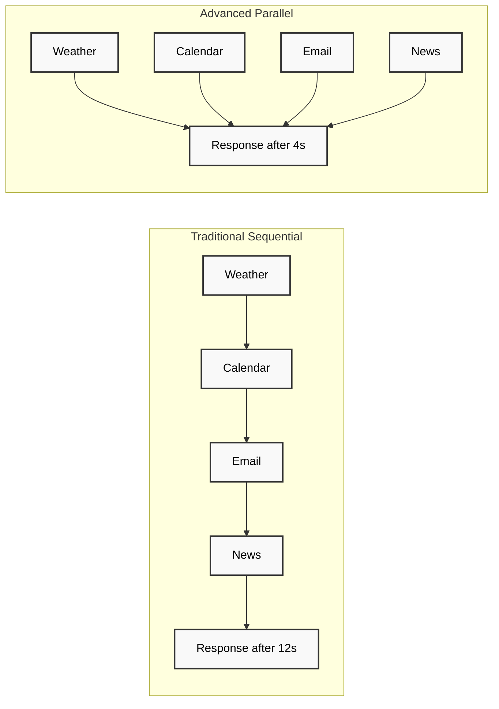

# 🚀 Getting Started

This guide will help you get up and running with the Advanced MCP Client quickly and efficiently.

## 📋 Prerequisites

Before you begin, ensure you have the following installed:

- **Node.js 18+** - [Download here](https://nodejs.org/)
- **PNPM** - Package manager (recommended)
- **Git** - For cloning the repository

```bash
# Check your versions
node --version  # Should be 18+
pnpm --version  # Latest stable
git --version   # Any recent version
```

## 🔧 Installation

### 1. Clone the Repository

```bash
git clone https://github.com/user/advanced-mcp-client.git
cd advanced-mcp-client
```

### 2. Install Dependencies

```bash
# Install all dependencies across the monorepo
pnpm install
```

### 3. Build the Project

```bash
# Build all packages and applications
pnpm build
```

### 4. Start the Client

```bash
# Start in development mode
pnpm dev

# Or start the built CLI
pnpm cli
```

## 🎯 Your First Parallel Execution

Let's run your first parallel tool execution to see the Advanced MCP Client in action:

### Example: Morning Briefing

This example demonstrates how multiple information sources are gathered concurrently:

```bash
# Start the CLI
pnpm cli

# In the CLI, enter:
> brief morning
```

**What happens:**
1. **Weather Service** - Gets current conditions
2. **Calendar API** - Fetches today's schedule  
3. **Email Service** - Summarizes new messages
4. **News API** - Gets relevant headlines

All of these run **simultaneously** instead of one after another!

### Traditional vs Parallel Execution



## 🎨 Terminal Interface Overview

The Advanced MCP Client features a rich terminal interface with multiple panes:

### Main Interface Components

- **Governor View** - Shows the Central Governor's current strategy and decisions
- **Task Execution View** - Live DAG visualization of running tasks
- **Context Inspector** - Shared context and session information
- **Command Input** - Interactive command interface

### Essential Commands

| Command | Description |
|---------|-------------|
| `/status` | Show system status and active tasks |
| `/governor` | Access Central Governor controls |
| `/threads` | View thread pool status |
| `/schedule` | Manage scheduled tasks |
| `/help` | Show all available commands |

## ⚙️ Configuration

### Basic Configuration

Create a configuration file at `~/.mcp-client/config.json`:

```json
{
  "threads": {
    "maxConcurrent": 8,
    "poolSize": 16
  },
  "governor": {
    "optimizationMode": "balanced",
    "maxRetries": 3
  },
  "ui": {
    "theme": "dark",
    "showProgress": true
  }
}
```

### Environment Variables

Set these environment variables for external service integration:

```bash
# LLM Configuration
export OPENAI_API_KEY="your-openai-key"
export ANTHROPIC_API_KEY="your-anthropic-key"

# External Services
export WEATHER_API_KEY="your-weather-key"
export GOOGLE_CALENDAR_CREDENTIALS="path/to/credentials.json"
```

### Server Mode

To run the client in server mode with web interface:

```bash
# Start the server
pnpm server

# Access web interface at http://localhost:3001
```

## 🔍 Verification

Verify your installation is working correctly:

### 1. Check System Status

```bash
pnpm cli status
```

Should show:
- ✅ Governor Service: Active
- ✅ Thread Pool: 8/16 threads available
- ✅ MCP Protocol: Connected
- ✅ Context Store: Ready

### 2. Run Health Check

```bash
pnpm cli health
```

### 3. Test Parallel Execution

```bash
# This should complete much faster than sequential execution
pnpm cli demo parallel
```

## 🚨 Troubleshooting

### Common Issues

**Build Failures**
```bash
# Clear cache and rebuild
pnpm clean
pnpm install
pnpm build
```

**Permission Errors**
```bash
# On Unix systems, you may need to set execute permissions
chmod +x ./apps/cli/bin/mcp-cli
```

**Port Conflicts**
```bash
# Change server port in configuration
export MCP_SERVER_PORT=3002
```

### Getting Help

If you encounter issues:

1. Check the [troubleshooting guide](/troubleshooting)
2. Look at [common examples](/examples)
3. Join our [Discord community](https://discord.gg/mcp-client)
4. Open an issue on [GitHub](https://github.com/user/advanced-mcp-client/issues)

## 🎯 Next Steps

Now that you have the Advanced MCP Client running:

1. **Explore the [Architecture](/architecture)** - Understand how the Central Governor and parallel execution work
2. **Review [Features](/features)** - Learn about all available capabilities
3. **Try [Examples](/examples)** - See real-world use cases and patterns
4. **Read [API Reference](/api)** - Dive into the technical details

---

<div className="bg-green-50 dark:bg-green-900/20 border border-green-200 dark:border-green-800 rounded-lg p-6 mt-8">
  <h3 className="text-green-800 dark:text-green-200 font-semibold mb-2">🎉 Congratulations!</h3>
  <p className="text-green-700 dark:text-green-300">
    You now have the Advanced MCP Client running with parallel execution capabilities. 
    You're ready to experience warp-speed tool execution!
  </p>
</div>