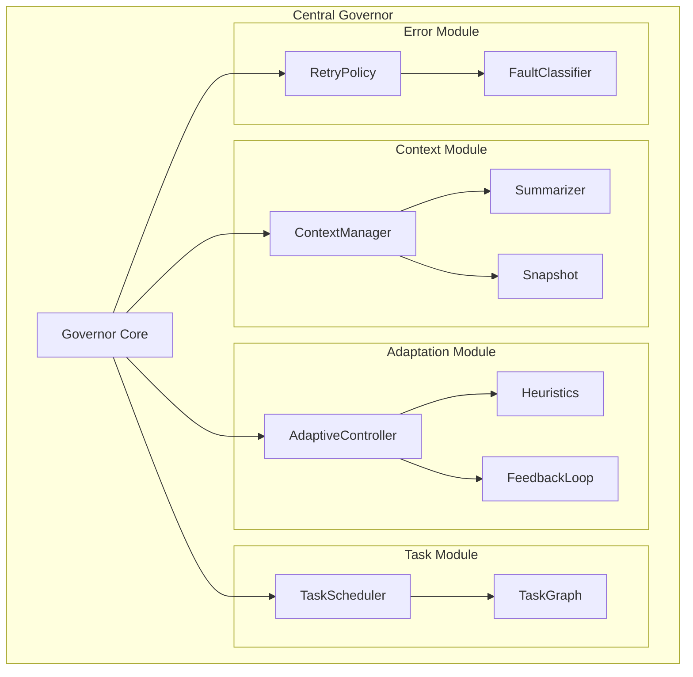

# 🧠 Central Governor System

The **Central Governor** is the intelligent orchestration engine at the heart of the Advanced MCP Client. It serves as the brain of the system, making real-time decisions about task execution, resource allocation, and system optimization.

## 🎯 Overview

The Governor transforms traditional sequential MCP tool execution into an intelligent, adaptive, and massively parallel system. It continuously monitors system state, analyzes performance metrics, and makes autonomous decisions to optimize execution workflows.

### Key Responsibilities

- **🔄 Task Orchestration**: Intelligently coordinates parallel task execution
- **📊 Performance Monitoring**: Continuously tracks system metrics and bottlenecks  
- **⚙️ Adaptive Control**: Dynamically adjusts system parameters based on conditions
- **🧠 Context Management**: Maintains conversation context across parallel executions
- **🛡️ Error Recovery**: Implements sophisticated fault tolerance and retry strategies
- **📈 Resource Optimization**: Optimizes CPU, memory, and thread utilization

## 🏗️ Architecture Overview



## 📁 System Structure

The Governor system is organized into modular components that promote separation of concerns:

### `/governor/core/`
Core orchestration components including the main Governor class, configuration management, and persistent state handling.

### `/governor/modules/context/`
Context management system responsible for maintaining conversation state, creating snapshots, and generating intelligent summaries.

### `/governor/modules/adaptation/`
Adaptive control mechanisms that monitor performance and dynamically adjust system behavior based on real-time feedback.

### `/governor/modules/tasks/`
Task scheduling and dependency management system that handles parallel execution coordination and workflow optimization.

### `/governor/modules/error/`
Comprehensive error handling system with intelligent classification, retry policies, and fault recovery strategies.

## 🚀 How It Works

### 1. **Request Analysis**
When a user request arrives, the Governor:
- Analyzes the request context and intent
- Breaks down complex requests into parallelizable sub-tasks
- Identifies dependencies and execution constraints
- Creates an optimized execution plan

### 2. **Intelligent Scheduling**
The Governor's scheduler:
- Prioritizes tasks based on importance and dependencies
- Allocates resources optimally across available threads
- Monitors execution progress in real-time
- Dynamically re-schedules based on performance feedback

### 3. **Adaptive Control**
Throughout execution, the Governor:
- Continuously monitors performance metrics
- Applies heuristic algorithms to detect optimization opportunities
- Adjusts parameters like thread allocation and retry policies
- Learns from execution patterns to improve future decisions

### 4. **Context Coordination**
The Governor maintains:
- Shared context across all parallel executions
- Intelligent summarization to prevent memory bloat
- Point-in-time snapshots for debugging and rollback
- Thread-safe context updates and retrieval

### 5. **Error Management**
When errors occur, the Governor:
- Classifies errors by type and severity
- Applies appropriate retry policies with exponential backoff
- Isolates failures to prevent cascade effects
- Implements alternative execution strategies when needed

## 📊 Performance Benefits

### Traditional Sequential Execution
```
Task 1 → Task 2 → Task 3 → Task 4
Total Time: 12 seconds
CPU Usage: ~25%
```

### Governor-Orchestrated Parallel Execution
```
Task 1 ↘
Task 2 → Aggregation → Result
Task 3 ↗
Task 4 ↗
Total Time: 4 seconds  
CPU Usage: ~90%
```

**Result**: 3x faster execution with intelligent resource utilization.

## 🎛️ Configuration

The Governor system is highly configurable to adapt to different workloads and environments:

```typescript
interface GovernorConfig {
  // Core settings
  maxConcurrentTasks: number;
  adaptationEnabled: boolean;
  contextRetentionPolicy: 'aggressive' | 'balanced' | 'minimal';
  
  // Performance tuning
  performanceThresholds: {
    cpuUtilization: number;
    memoryUsage: number;
    taskQueueDepth: number;
  };
  
  // Retry policies
  retrySettings: {
    maxRetries: number;
    backoffStrategy: 'exponential' | 'linear' | 'fixed';
    timeoutMs: number;
  };
}
```

## 🔗 Integration Points

The Governor integrates seamlessly with other system components:

- **Thread Pool**: Manages worker thread allocation and utilization
- **MCP Protocol**: Ensures full compatibility with standard MCP operations  
- **Session Manager**: Coordinates with session state and user context
- **Security System**: Applies permission policies and access controls
- **Monitoring System**: Provides telemetry and performance analytics

## 📚 Deep Dive Sections

Explore specific aspects of the Governor system:

- [**Core Components**](/governor/core) - Governor class, configuration, and state management
- [**Context Management**](/governor/context) - Context handling, snapshots, and summarization
- [**Adaptation System**](/governor/adaptation) - Performance monitoring and adaptive control
- [**Task Scheduling**](/governor/tasks) - Parallel execution and dependency management  
- [**Error Handling**](/governor/error) - Fault tolerance and recovery strategies
- [**API Reference**](/governor/api) - Complete API documentation and examples

---

The Central Governor represents a paradigm shift from reactive tool execution to proactive, intelligent orchestration. It transforms the Advanced MCP Client into a self-optimizing system that continuously adapts to provide the best possible performance and user experience.