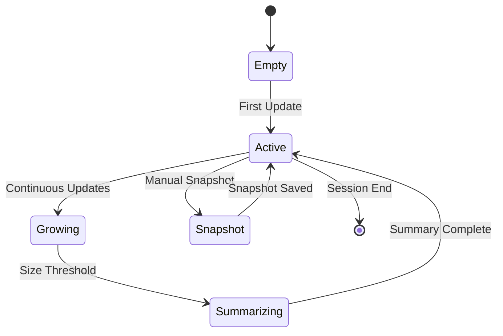

# 💾 Context Management System

The context management module is responsible for maintaining conversational context, creating intelligent snapshots, and providing efficient context retrieval across parallel task executions.

## 📁 Context Module Structure

```
governor/modules/context/
├── ContextManager.ts    # Core context lifecycle management
├── Summarizer.ts        # Intelligent context summarization
├── Snapshot.ts          # Point-in-time context snapshots
├── types.ts            # TypeScript type definitions
└── index.ts            # Module exports
```

## 🎯 ContextManager (`ContextManager.ts`)

The central component responsible for context data lifecycle management across the entire system.

### Class Definition

```typescript
class ContextManager {
  private context: ContextSnapshot;
  private summarizer: Summarizer;
  private snapshotManager: SnapshotManager;
  private config: ContextConfig;
  
  constructor(config: ContextConfig)
  getContext(): ContextSnapshot
  updateContext(update: ContextUpdate): void
  summarizeIfNeeded(): Promise<void>
  createSnapshot(): Promise<string>
  restoreSnapshot(snapshotId: string): Promise<void>
}
```

### Core Functionality

#### Context Retrieval
```typescript
getContext(): ContextSnapshot {
  // Returns current context state
  // Includes conversation history
  // Provides task execution context
  // Ensures thread-safe access
}
```

#### Context Updates
```typescript
updateContext(update: ContextUpdate): void {
  // Applies incremental updates to context
  // Maintains consistency across parallel operations
  // Triggers summarization if thresholds exceeded
  // Notifies dependent modules of changes
}
```

#### Automatic Summarization
```typescript
async summarizeIfNeeded(): Promise<void> {
  // Monitors context size against thresholds
  // Triggers intelligent summarization
  // Preserves essential information
  // Reduces memory footprint
}
```

### Context Lifecycle



## 📝 Intelligent Summarizer (`Summarizer.ts`)

Generates concise, intelligent summaries of context data to maintain system efficiency while preserving critical information.

### Summarization Function

```typescript
function summarizeContext(context: ContextSnapshot): Summary {
  // Analyzes context for key information
  // Applies natural language processing
  // Preserves critical decision points
  // Reduces size while maintaining meaning
}
```

### Summarization Strategy

The summarizer employs a multi-layered approach:

#### 1. **Content Analysis**
- Identifies key conversation topics
- Extracts important decisions and outcomes
- Preserves user preferences and constraints
- Maintains task execution history

#### 2. **Importance Scoring**
- Assigns relevance scores to context elements
- Considers recency and frequency of reference
- Weights based on user interaction patterns
- Factors in task success/failure outcomes

#### 3. **Compression Techniques**
- **Semantic Compression**: Maintains meaning while reducing verbosity
- **Temporal Compression**: Summarizes sequences of related events
- **Redundancy Elimination**: Removes repetitive information
- **Priority Preservation**: Keeps high-priority context intact

#### 4. **Quality Validation**
- Ensures summary maintains coherence
- Validates preservation of critical information
- Checks compression ratio effectiveness
- Verifies context usability post-summarization

### Summary Structure

```typescript
interface Summary {
  id: string;
  originalSize: number;
  compressedSize: number;
  compressionRatio: number;
  timestamp: number;
  
  content: {
    keyTopics: string[];
    criticalDecisions: Decision[];
    userPreferences: Preference[];
    taskHistory: TaskSummary[];
    preservedContext: ContextFragment[];
  };
  
  metadata: {
    summarizationMethod: string;
    qualityScore: number;
    preservationRate: number;
  };
}
```

## 📸 Snapshot Management (`Snapshot.ts`)

Provides point-in-time context capture for debugging, auditing, and rollback scenarios.

### Snapshot Functions

```typescript
function createSnapshot(): ContextSnapshot {
  // Captures complete current context state
  // Includes all conversation history
  // Preserves task execution state
  // Returns immutable snapshot object
}

function restoreSnapshot(snapshot: ContextSnapshot): void {
  // Restores context to snapshot state
  // Validates snapshot integrity
  // Updates all dependent modules
  // Ensures system consistency
}
```

### Snapshot Types

#### **Manual Snapshots**
- Created on explicit user request
- Useful for experimentation and rollback
- Preserved indefinitely until deletion
- Named and annotated for easy identification

#### **Automatic Snapshots**
- Created at regular intervals
- Triggered by significant system events
- Maintained according to retention policy
- Used for system recovery and debugging

#### **Event-Triggered Snapshots**
- Created before major operations
- Captured during error conditions
- Generated at decision points
- Used for post-mortem analysis

### Snapshot Storage

```typescript
interface SnapshotStorage {
  snapshots: Map<string, ContextSnapshot>;
  metadata: SnapshotMetadata[];
  
  store(snapshot: ContextSnapshot): string;
  retrieve(id: string): ContextSnapshot | null;
  list(): SnapshotMetadata[];
  cleanup(): number; // Returns cleaned count
}
```

## 🏗️ Type Definitions (`types.ts`)

Comprehensive TypeScript definitions for the context management system.

### Core Types

```typescript
namespace ContextTypes {
  interface ContextSnapshot {
    id: string;
    timestamp: number;
    sessionId: string;
    
    conversation: {
      messages: ConversationMessage[];
      totalLength: number;
      lastUpdate: number;
    };
    
    execution: {
      activeTasks: TaskContext[];
      completedTasks: TaskResult[];
      failedTasks: TaskError[];
    };
    
    user: {
      preferences: UserPreference[];
      patterns: UsagePattern[];
      constraints: UserConstraint[];
    };
    
    system: {
      performance: PerformanceContext;
      resources: ResourceContext;
      configuration: ConfigContext;
    };
  }

  interface ContextUpdate {
    type: 'message' | 'task' | 'preference' | 'system';
    data: any;
    timestamp: number;
    source: string;
  }

  interface Summary {
    id: string;
    sourceSnapshotId: string;
    compressionRatio: number;
    preservedElements: number;
    content: SummaryContent;
    metadata: SummaryMetadata;
  }
}
```

### Message Types

```typescript
interface ConversationMessage {
  id: string;
  role: 'user' | 'assistant' | 'system';
  content: string;
  timestamp: number;
  metadata: {
    tokens: number;
    importance: number;
    references: string[];
  };
}
```

### Task Context Types

```typescript
interface TaskContext {
  taskId: string;
  status: 'pending' | 'running' | 'completed' | 'failed';
  startTime: number;
  duration?: number;
  dependencies: string[];
  results?: any;
  errors?: Error[];
}
```

## 🔄 Integration with Governor

The context management system integrates seamlessly with other Governor modules:

### **Task Coordination**
- Provides execution context for informed task scheduling
- Maintains task history for dependency resolution
- Shares context across parallel task executions

### **Adaptation Integration**
- Supplies usage patterns for adaptive optimization
- Provides performance context for decision making
- Enables learning from historical execution patterns

### **Error Handling Integration**
- Preserves error context for intelligent recovery
- Maintains failure patterns for predictive error handling
- Provides rollback capabilities for critical failures

## 📊 Performance Optimization

The context system is optimized for high-performance operation:

### **Memory Management**
- Intelligent garbage collection of old context
- Configurable retention policies
- Efficient data structures for large contexts
- Memory-mapped storage for large snapshots

### **Access Patterns**
- Thread-safe concurrent access
- Optimized for read-heavy workloads
- Cached frequently accessed context elements
- Lazy loading of historical data

### **Compression Efficiency**
- Real-time compression ratio monitoring
- Adaptive compression strategies
- Quality-vs-size optimization
- Configurable compression thresholds

## 🛠️ Configuration Options

```typescript
interface ContextConfig {
  // Size Management
  maxContextSize: number;
  summarizationThreshold: number;
  compressionTarget: number; // Target compression ratio
  
  // Snapshot Management
  snapshotInterval: number;
  maxSnapshots: number;
  snapshotRetention: number; // Time in ms
  
  // Performance Tuning
  cacheSize: number;
  lazyLoadThreshold: number;
  concurrencyLevel: number;
  
  // Quality Control
  minQualityScore: number;
  preservationRate: number;
  validationEnabled: boolean;
}
```

## 🔍 Monitoring and Diagnostics

The context system provides comprehensive monitoring:

### **Context Metrics**
```typescript
interface ContextMetrics {
  currentSize: number;
  compressionRatio: number;
  summarizationFrequency: number;
  snapshotCount: number;
  accessPatterns: AccessPattern[];
  performanceMetrics: {
    averageRetrievalTime: number;
    averageUpdateTime: number;
    cacheHitRatio: number;
  };
}
```

### **Health Monitoring**
- Context size trending
- Summarization effectiveness
- Snapshot integrity validation
- Memory usage optimization
- Access pattern analysis

---

The Context Management System ensures that the Advanced MCP Client maintains intelligent, efficient, and comprehensive awareness of conversation and execution context, enabling informed decision-making across all parallel operations while optimizing memory usage and system performance.