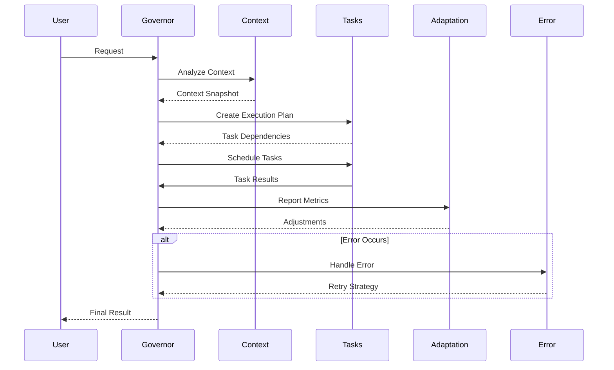

# 🏗️ Governor Core Components

The core module contains the foundational components of the Governor system, including the main orchestrator class, configuration management, and persistent state handling.

## 📁 Core Module Structure

```
governor/core/
├── Governor.ts          # Main orchestrator class
├── GovernorConfig.ts    # Configuration schema and validation
├── GovernorState.ts     # State management and persistence
└── index.ts            # Module exports
```

## 🎯 Governor Class (`Governor.ts`)

The central orchestrator responsible for coordinating all system operations.

### Class Definition

```typescript
class Governor {
  private config: GovernorConfig;
  private state: GovernorState;
  private modules: {
    context: ContextManager;
    adaptation: AdaptiveController;
    tasks: TaskScheduler;
    error: RetryPolicy;
  };
  
  constructor(config: GovernorConfig)
  start(): Promise<void>
  stop(): Promise<void>
  dispatchTask(task: Task): Promise<TaskResult>
}
```

### Key Methods

#### `constructor(config: GovernorConfig)`
Initializes the Governor with provided configuration:
- Validates configuration parameters
- Initializes all module components
- Sets up inter-module communication
- Establishes monitoring and feedback loops

#### `start(): Promise<void>`
Begins the governor's operation loop:
- Activates all modules and their monitoring systems
- Starts performance metrics collection
- Initializes adaptive control mechanisms
- Begins processing task queue

#### `stop(): Promise<void>`
Gracefully terminates the governor's operation:
- Completes in-flight tasks
- Saves current state for persistence
- Cleanly shuts down all modules
- Releases system resources

#### `dispatchTask(task: Task): Promise<TaskResult>`
Core task orchestration method:
- Analyzes task requirements and dependencies
- Determines optimal execution strategy
- Coordinates with relevant modules
- Monitors execution and handles results

### Orchestration Flow



## ⚙️ Governor Configuration (`GovernorConfig.ts`)

Manages all configuration aspects of the Governor system.

### Configuration Interface

```typescript
interface GovernorConfig {
  // Core Settings
  maxConcurrentTasks: number;
  adaptationEnabled: boolean;
  contextRetentionPolicy: 'aggressive' | 'balanced' | 'minimal';
  
  // Performance Thresholds
  performanceThresholds: {
    cpuUtilization: number;        // 0.0 - 1.0
    memoryUsage: number;           // Bytes
    taskQueueDepth: number;        // Max queued tasks
    responseTimeMs: number;        // Target response time
  };
  
  // Adaptation Settings
  adaptationSettings: {
    feedbackIntervalMs: number;
    adjustmentSensitivity: number; // 0.0 - 1.0
    learningRate: number;          // 0.0 - 1.0
  };
  
  // Retry Configuration
  retrySettings: {
    maxRetries: number;
    backoffStrategy: 'exponential' | 'linear' | 'fixed';
    baseDelayMs: number;
    maxDelayMs: number;
    timeoutMs: number;
  };
  
  // Context Management
  contextSettings: {
    maxContextSize: number;        // Bytes
    summarizationThreshold: number; // Context size trigger
    snapshotIntervalMs: number;
    retentionTimeMs: number;
  };
}
```

### Configuration Validation

```typescript
function validateConfig(config: Partial<GovernorConfig>): GovernorConfig {
  // Provides validation logic with defaults
  // Ensures all required fields are present
  // Validates ranges and constraints
  // Returns complete, validated configuration
}
```

### Default Configuration

```typescript
const DEFAULT_CONFIG: GovernorConfig = {
  maxConcurrentTasks: 8,
  adaptationEnabled: true,
  contextRetentionPolicy: 'balanced',
  
  performanceThresholds: {
    cpuUtilization: 0.85,
    memoryUsage: 1024 * 1024 * 512, // 512MB
    taskQueueDepth: 100,
    responseTimeMs: 5000
  },
  
  adaptationSettings: {
    feedbackIntervalMs: 1000,
    adjustmentSensitivity: 0.3,
    learningRate: 0.1
  },
  
  retrySettings: {
    maxRetries: 3,
    backoffStrategy: 'exponential',
    baseDelayMs: 1000,
    maxDelayMs: 30000,
    timeoutMs: 60000
  },
  
  contextSettings: {
    maxContextSize: 1024 * 1024 * 10, // 10MB
    summarizationThreshold: 1024 * 1024 * 5, // 5MB
    snapshotIntervalMs: 30000,
    retentionTimeMs: 3600000 // 1 hour
  }
};
```

## 💾 Governor State Management (`GovernorState.ts`)

Handles persistence and restoration of Governor state across sessions.

### State Interface

```typescript
interface GovernorState {
  // Core State
  lastStartTime: number;
  totalTasksProcessed: number;
  averageResponseTime: number;
  
  // Performance History
  performanceHistory: {
    timestamp: number;
    cpuUtilization: number;
    memoryUsage: number;
    activeTaskCount: number;
    queueDepth: number;
  }[];
  
  // Adaptation State
  adaptationState: {
    currentParameters: {
      threadPoolSize: number;
      taskTimeoutMs: number;
      retryBackoffMultiplier: number;
    };
    learningData: {
      successfulAdjustments: number;
      failedAdjustments: number;
      lastAdjustmentTime: number;
    };
  };
  
  // Context State
  contextState: {
    activeSnapshots: ContextSnapshot[];
    summarizationMetrics: {
      totalSummarizations: number;
      averageCompressionRatio: number;
    };
  };
  
  // Error State
  errorState: {
    errorHistory: {
      timestamp: number;
      errorType: string;
      severity: 'low' | 'medium' | 'high' | 'critical';
      resolved: boolean;
    }[];
    retryStatistics: {
      totalRetries: number;
      successfulRetries: number;
      averageRetryDelay: number;
    };
  };
}
```

### State Persistence

```typescript
function saveState(): GovernorState {
  // Serializes current Governor state
  // Captures performance metrics
  // Preserves adaptation learning data
  // Returns serializable state object
}

function loadState(state: GovernorState): void {
  // Restores Governor from serialized state
  // Reconstructs performance history
  // Restores adaptation parameters
  // Resumes operation from saved state
}
```

### State Lifecycle

1. **Initialization**: State loaded from persistent storage or defaults created
2. **Runtime Updates**: State continuously updated as system operates
3. **Periodic Persistence**: State automatically saved at regular intervals
4. **Graceful Shutdown**: Final state save before system termination
5. **Recovery**: State restoration during system restart

## 🔄 Module Integration

The core components work together to provide seamless Governor operation:

### Initialization Flow

```typescript
// 1. Configuration Validation
const config = validateConfig(userConfig);

// 2. State Management Setup
const state = loadState() || createDefaultState();

// 3. Governor Instantiation
const governor = new Governor(config);

// 4. Module Initialization
await governor.start();

// 5. Ready for Operation
governor.dispatchTask(task);
```

### Inter-Module Communication

The Governor core facilitates communication between modules:

- **Context ↔ Tasks**: Sharing execution context for informed scheduling
- **Adaptation ↔ Performance**: Feedback loops for system optimization
- **Error ↔ Tasks**: Retry coordination and failure isolation
- **State ↔ All Modules**: Persistent state management across restarts

## 📊 Monitoring and Diagnostics

The core provides comprehensive monitoring capabilities:

### Performance Metrics

```typescript
interface CoreMetrics {
  uptime: number;
  tasksProcessed: number;
  averageTaskDuration: number;
  systemResourceUsage: {
    cpu: number;
    memory: number;
    threads: number;
  };
  moduleStatus: {
    context: 'active' | 'idle' | 'error';
    adaptation: 'active' | 'idle' | 'error';
    tasks: 'active' | 'idle' | 'error';
    error: 'active' | 'idle' | 'error';
  };
}
```

### Health Checks

The Governor core implements comprehensive health monitoring:

- **Module Health**: Continuous monitoring of all module states
- **Resource Health**: CPU, memory, and thread utilization tracking
- **Performance Health**: Response time and throughput monitoring
- **Error Rate Health**: Error frequency and recovery success tracking

---

The Governor core components provide the foundation for intelligent orchestration, ensuring reliable, efficient, and adaptive operation of the entire Advanced MCP Client system.