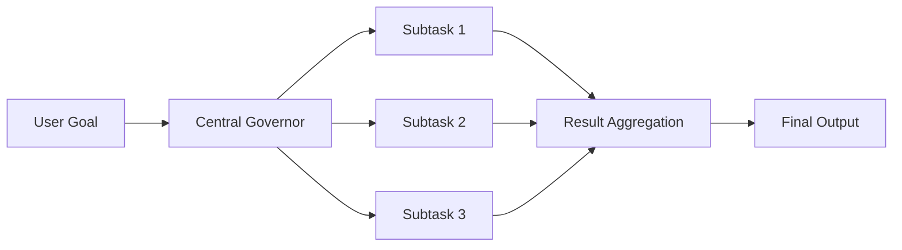
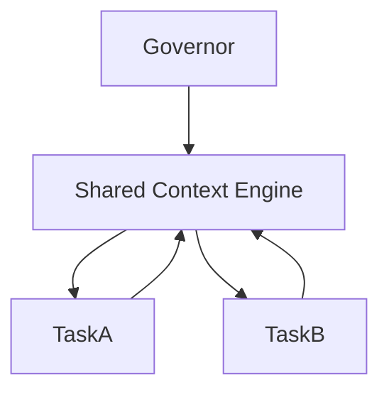
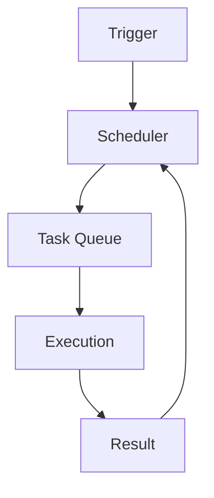
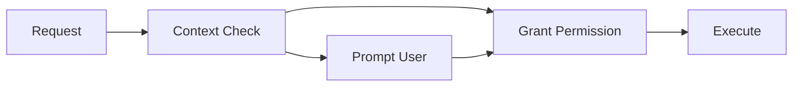
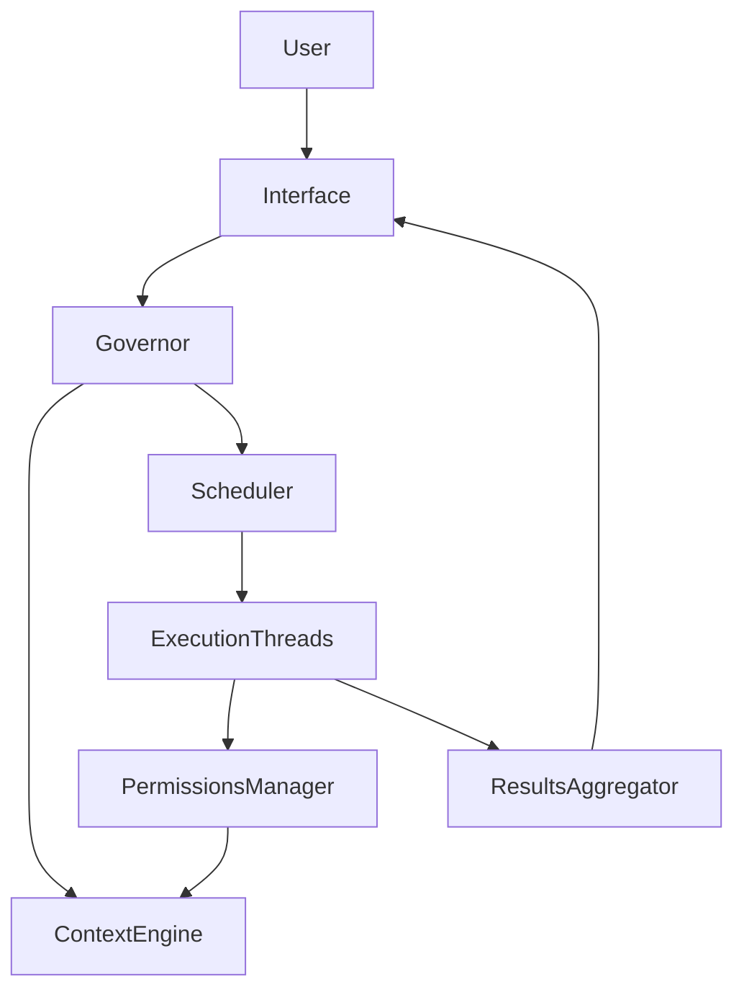
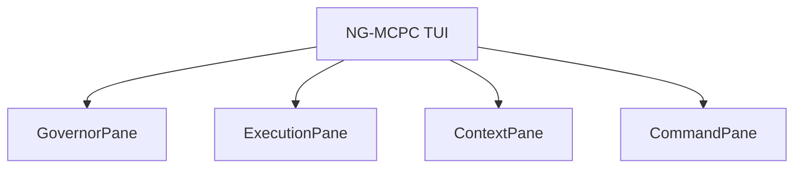

# 🚀 Advanced MCP Client (NG-MCPC) Overview

## 🌟 Comprehensive Introduction

The Next-Generation Model Context Protocol Client (NG-MCPC) redefines AI-driven task execution by integrating intelligent orchestration, parallel processing, dynamic context management, and sophisticated security systems. This comprehensive document thoroughly outlines each aspect of NG-MCPC, supported by detailed diagrams, tables, and charts.

## 🎯 Objectives & Vision

NG-MCPC is crafted to:

- **Enhance Task Orchestration**: Automate intelligent task decomposition and execution.
- **Enable Parallel Execution**: Dramatically speed up AI operations through simultaneous task processing.
- **Dynamic Context Management**: Facilitate real-time context sharing and synchronization across diverse tasks.
- **Robust Security & Reliability**: Implement context-aware, frictionless security measures.

## ⚙️ Detailed Feature Set

### 1. Central Governor

The Central Governor functions as the strategic brain of NG-MCPC, orchestrating tasks intelligently based on dynamic analysis of context and dependencies.

#### Governor Responsibilities:

- Task decomposition into subtasks.
- Dependency mapping and prioritization.
- Resource allocation and load balancing.

#### Governor Process Flow:



### 2. Warp-Speed Parallel Execution

Parallel processing dramatically reduces execution time by running multiple tasks concurrently rather than sequentially.

#### Parallel Execution Comparison:

| Method      | Execution Model | Completion Time            |
| ----------- | --------------- | -------------------------- |
| Traditional | Sequential      | Cumulative (Slow)          |
| NG-MCPC     | Parallel        | Longest single task (Fast) |

### 3. Dynamic Shared Context Engine

A real-time shared context that is continuously updated and accessible to all tasks, ensuring consistency and informed execution.

#### Shared Context Diagram:



### 4. Adaptive Task Scheduler

The Adaptive Scheduler manages tasks based on triggers, dependencies, and priorities in real-time.

#### Scheduler Triggers:

| Trigger Type     | Description               | Example          |
| ---------------- | ------------------------- | ---------------- |
| Time-based       | Scheduled intervals       | Cron jobs        |
| Event-driven     | Specific event occurrence | File upload      |
| Dependency-based | Task completion           | Dependency check |

### Scheduler Workflow:



### 5. Intelligent Permissions Management

Context-aware security controls manage permissions dynamically, minimizing user interruptions while maintaining robust security.

#### Permissions Flow:



## 🧱 Comprehensive Architectural Overview

### System Architecture Diagram:



## 🔄 Execution Flow Analysis

### Traditional Sequential vs. NG-MCPC Parallel Execution:

| Task                | Traditional (Sequential)            | NG-MCPC (Parallel)  |
| ------------------- | ----------------------------------- | ------------------- |
| Task Initialization | Waits for completion of prior tasks | Immediate execution |
| Context Updates     | Occurs after each task              | Continuous updates  |
| Total Execution     | Sum of all tasks                    | Longest single task |

## 📈 Practical Use Case: Complex Library Integration

Detailed steps for integrating a new analytics library:

- Parallel Tasks:

  - Downloading and installation
  - Dependency analysis
  - Event instrumentation
  - Incremental documentation
  - Test generation and execution

- Dynamic Adaptation:

  - Real-time conflict resolution
  - Immediate updates and task adjustments

## 🎨 Terminal User Interface (TUI) Deep Dive

The NG-MCPC TUI enhances user experience through real-time visualization and interactive management.

### Interface Components:

- **Governor Pane**: Live orchestration view.
- **Execution Pane**: Real-time task progress graphs.
- **Context Pane**: Detailed context information.
- **Command Pane**: Interactive task control.

### Sample TUI Layout:



## 🗺️ Detailed Development Roadmap

| Phase   | Features                                    | Status       |
| ------- | ------------------------------------------- | ------------ |
| Phase 1 | Core functionality, parallel execution      | ✅ Completed |
| Phase 2 | Advanced orchestration, adaptive scheduling | 🚧 Current   |
| Phase 3 | AI prioritization, error management         | 🔜 Upcoming  |
| Phase 4 | Expanded interfaces, distributed execution  | 📅 Planned   |

## 🛠 Step-by-Step Quick Start

```bash
git clone https://github.com/user/advanced-mcp-client.git
cd advanced-mcp-client
npm install
npm run build
npm start
```

## 🤝 Community Collaboration & Contributions

Encouraged participation includes:

- Feedback on real-world implementations
- Feature development and testing
- Custom integrations and pilot programs

## 📄 Licensing Information

Distributed under the MIT License, fostering open collaboration and innovation.

---

**NG-MCPC: A comprehensive, intelligent, and scalable solution setting the benchmark for future MCP clients.**
