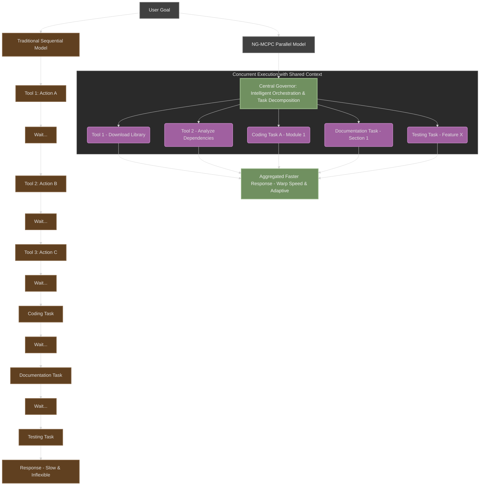
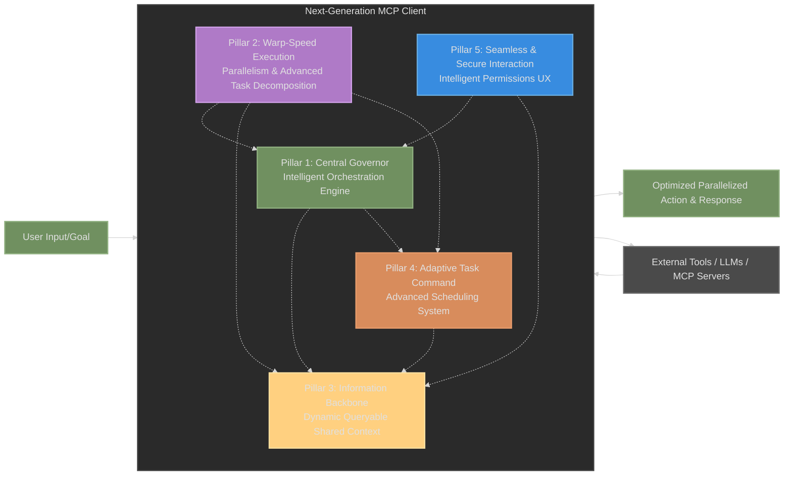
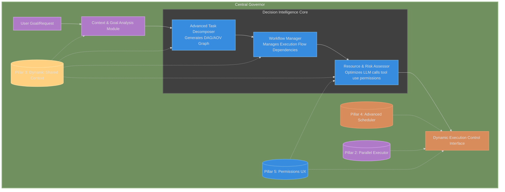
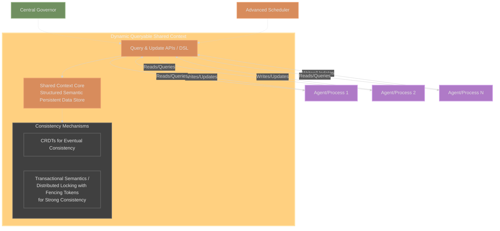
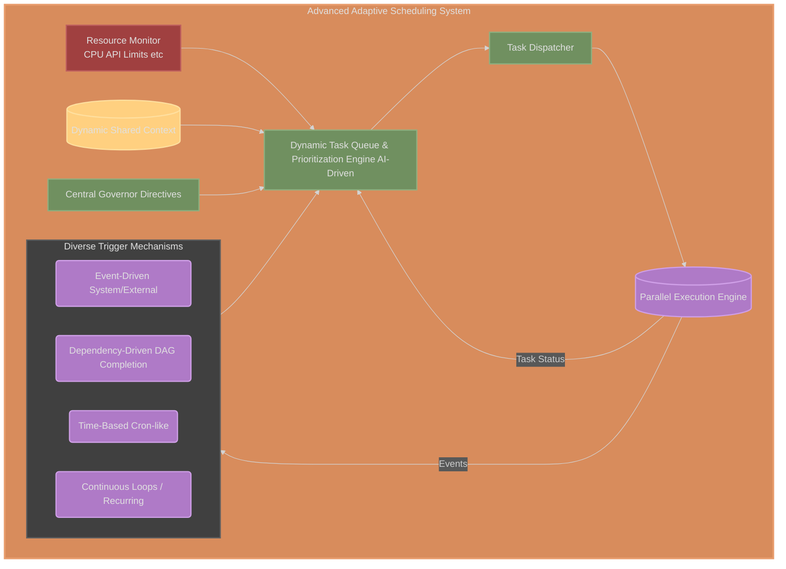
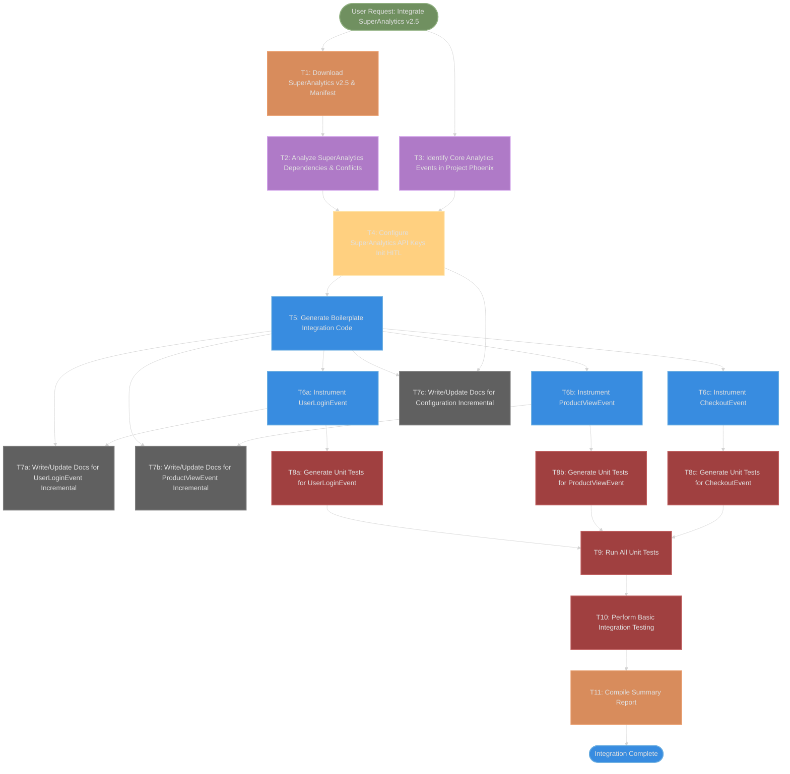
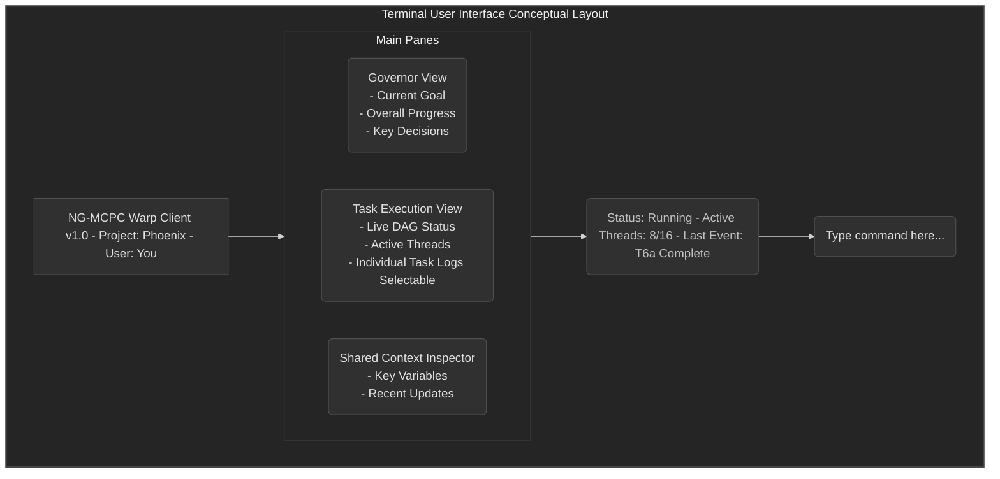

<div align="center">

# Project Overview: The Warp-Speed NG-MCPC

## Intelligent Orchestration for Parallel Agentic Coding

**Revolutionizing Model Context Protocol (MCP) Clients with Intelligent Orchestration and Massively Parallel Execution**

_From Sequential Crawls to Warp-Speed Agentic Systems: No Hoops, Just Results._

---

[](https://www.typescriptlang.org/)
[](https://nodejs.org/)
[](LICENSE)

</div>

---

## 1. Vision & Mission: Unleashing Agentic Warp Speed

**The Core Frustration:** Today's agentic coding systems and MCP clients, while promising, are often shackled by a fundamental limitation: **sequential task execution**. When an AI needs to perform multiple actions—install a library, update documentation, write code, run tests—it typically does so one step after another. This linear, back-and-forth approach creates frustrating bottlenecks, underutilizes system resources, and delivers a sluggish user experience. Simple multi-step requests can take an agonizingly long time to complete, stifling the true potential of AI-assisted development.

**Our Revolutionary Leap:** The Next-Generation MCP Client (NG-MCPC) is not just an improvement; it's a **paradigm shift**. We are building a client engineered from the ground up for **intelligent orchestration and massively parallel execution**. Imagine an agentic system that doesn't just follow a linear script but strategically decomposes complex goals, executing myriad sub-tasks concurrently, all while maintaining a coherent, shared understanding of the overall objective.



**Mission:** To create a faster, more capable, and flexible MCP client that empowers users and AI agents to accomplish complex tasks at unprecedented speeds. We aim to eliminate unnecessary "hoops" and deliver an experience where the system intelligently manages complexity, allowing for seamless, powerful, and truly parallelized agentic coding. The NG-MCPC will be the engine that drives agentic systems at **warp speed**.

## 2. The Imperative for Evolution: Breaking Free from Sequential Chains

Current MCP implementations and agentic frameworks, while foundational for enabling AI model interaction with tools and context, suffer from several critical limitations that the NG-MCPC is designed to overcome:

- **Predominantly Sequential Task Execution:** The most significant bottleneck. Tasks are often processed in a rigid, linear order, even when components could be handled in parallel. This inherently limits throughput, responsiveness, and the system's ability to tackle truly complex, multi-faceted problems efficiently.
- **Basic and Static Context Management:** Context is often handled per-session or in a limited fashion, hindering the ability of multiple processes to access a rich, evolving, and shared understanding of the task environment in real-time. This leads to "brittle integrations" and agents operating with insufficient information.
- **Rigid and Unresponsive Scheduling:** Task scheduling is typically tied to direct invocation or simple queues, lacking support for complex event-driven triggers, dynamic prioritization based on real-time needs, or sophisticated dependency management for parallel task graphs.
- **User Experience Friction (Permissions & Oversight):** Constant prompts for permission, even for routine actions, can cripple workflow automation and negate the speed benefits of AI assistance. Users feel needlessly hassled rather than empowered.

These limitations are not isolated issues but systemic constraints. The NG-MCPC addresses them holistically, transforming the client from a simple protocol handler into an intelligent execution environment.

## 3. Introducing the NG-MCPC: A New Architectural Vision

The Next-Generation MCP Client (NG-MCPC) is architected to be a high-performance, intelligent, and adaptive environment for executing complex, multi-agent tasks. It embodies a philosophy of **intelligent autonomy with robust, user-centric oversight.**

**Core Design Tenets:**

- **Intelligence by Default:** The system is designed to understand intent, anticipate needs, and make smart decisions about task execution and resource allocation.
- **Concurrency as a Standard:** Parallel execution is not an afterthought but a fundamental principle, deeply embedded in the architecture.
- **Context as the Lifeblood:** A dynamic, shared, and efficiently queryable context is central, enabling informed and coordinated actions.
- **Adaptive Control:** Orchestration and scheduling are not static but dynamically adjust to real-time events and evolving priorities.
- **Seamless User Experience:** Interactions, especially around permissions, are designed to be intuitive, minimizing friction while maximizing user control and trust. The user should feel safe but not needlessly hassled.

This vision positions the NG-MCPC as a key enabler for truly autonomous and collaborative AI systems, where the client itself functions as an intelligent node capable of managing the entire lifecycle of complex AI tasks.

## 4. Core Architectural Pillars: The Engine of Warp Speed

The NG-MCPC is built upon five interconnected foundational pillars. Their synergy is what enables the leap in performance and capability.



### 4.1. The Central Governor: Intelligent Orchestration Engine

**Concept:** At the heart of the NG-MCPC lies the **Central Governor**, an Intelligent Orchestration Engine that acts as the strategic brain of the system. It moves far beyond simple task handoffs, providing sophisticated, goal-oriented coordination of all agents and processes. The Governor is responsible for understanding high-level user requests, decomposing them into manageable and parallelizable sub-tasks, and dynamically managing their execution.



**Capabilities:**

- **Advanced Task Decomposition:** Employs AI-driven techniques to break down complex goals (e.g., "integrate a new library") into a granular graph of sub-tasks (Directed Acyclic Graph - DAG / Activity-on-Vertex - AOV), meticulously analyzing dependencies and identifying all possible parallel execution paths.
- **Dynamic Workflow Management:** Manages intricate workflows involving multiple stages, conditional logic, loops, and a mix of sequential and parallel execution. It defines execution sequences and manages inter-agent/task dependencies with precision.
- **Goal-Oriented Coordination:** Guides individual agents and processes towards achieving broader objectives, enabling complex problem-solving.
- **Intelligent Resource Allocation & Optimization:** Works with the Advanced Scheduling System to optimize LLM calls, tool access, and computational resources across concurrent tasks.
- **Contextual Decision Making:** Utilizes the Dynamic Shared Context to make informed, adaptive decisions about task planning, execution strategy, and error recovery. (This mirrors the "Governor Decision Process": User Query → Context Analysis → Task Planning → Resource Assessment → Execution Planning → Monitoring → Analysis → Optimization → Validation).
- **Agent Discovery & Capability Management:** Maintains a registry of available agents/tools and their capabilities to dynamically select the best components for each sub-task.

The Central Governor ensures that tasks are not just executed, but executed _intelligently_, maximizing efficiency and adapting to the dynamic nature of complex projects.

### 4.2. Warp-Speed Execution: True Parallelism & Advanced Task Decomposition

**Concept:** The NG-MCPC revolutionizes execution through a robust **multi-threaded model** and the Governor's **advanced task decomposition**. This enables genuine parallel processing, even for workflows that appear sequential on the surface, dramatically boosting speed and responsiveness.

```mermaid
%%{init: {'theme': 'dark'}}%%
flowchart TD
    subgraph TraditionalSequential ["Traditional Sequential Flow"]
        U1[User Input] --> L1[LLM Analysis]
        L1 --> T1_S[Tool 1<br/>Execute & Wait]
        T1_S --> T2_S[Tool 2<br/>Execute & Wait]
        T2_S --> T3_S[Tool 3<br/>Execute & Wait]
        T3_S --> R1[Response<br/>Sum of all tool times]
    end

    subgraph NG_MCPC_Parallel ["NG-MCPC Parallel Flow with Governor Oversight"]
        U2[User Input] --> L2[LLM Analysis Optional Initial]
        L2 --> G[Central Governor<br/>Context Analysis Task Decomposition & Planning DAG]

        subgraph ThreadPool ["Thread Pool & Parallel Execution Engine"]
            direction LR
            G --> T1_P(Task/Tool 1<br/>Monitored Execution)
            G --> T2_P(Task/Tool 2<br/>Monitored Execution)
            G --> T3_P(Task/Tool 3<br/>Monitored Execution)
            G --> TN_P(Task N<br/>Monitored Execution)
        end

        ThreadPool --> A[Result Aggregator & Governor Validation]
        A --> R2[Optimized Response<br/>Time of Longest Independent Path]

        G -.-> T1_P
        G -.-> T2_P
        G -.-> T3_P
        G -.-> TN_P
        G -.-> A
    end

    style U1 fill:#A04040,stroke:#C06060,stroke-width:2px,color:#E0E0E0,padding:10px;
    style L1 fill:#D88C5C,stroke:#E89C6C,stroke-width:2px,color:#E0E0E0,padding:10px;
    style R1 fill:#A04040,stroke:#C06060,stroke-width:2px,color:#E0E0E0,padding:10px;
    style T1_S fill:#D88C5C,stroke:#E89C6C,stroke-width:2px,color:#E0E0E0,padding:10px;
    style T2_S fill:#D88C5C,stroke:#E89C6C,stroke-width:2px,color:#E0E0E0,padding:10px;
    style T3_S fill:#D88C5C,stroke:#E89C6C,stroke-width:2px,color:#E0E0E0,padding:10px;
    style U2 fill:#709060,stroke:#90B080,stroke-width:2px,color:#E0E0E0,padding:10px;
    style L2 fill:#FFD080,stroke:#FFE0A0,stroke-width:2px,color:#E0E0E0,padding:10px;
    style G fill:#709060,stroke:#90B080,stroke-width:3px,color:#F0F0F0,padding:10px;
    style R2 fill:#709060,stroke:#90B080,stroke-width:2px,color:#E0E0E0,padding:10px;
    style ThreadPool fill:#AF7AC7,stroke:#D0A0E8,stroke-width:2px,color:#E0E0E0;
    style T1_P fill:#388CE0,stroke:#68ACE0,stroke-width:2px,color:#E0E0E0,padding:10px;
    style T2_P fill:#388CE0,stroke:#68ACE0,stroke-width:2px,color:#E0E0E0,padding:10px;
    style T3_P fill:#388CE0,stroke:#68ACE0,stroke-width:2px,color:#E0E0E0,padding:10px;
    style TN_P fill:#388CE0,stroke:#68ACE0,stroke-width:2px,color:#E0E0E0,padding:10px;
    style A fill:#D88C5C,stroke:#E89C6C,stroke-width:2px,color:#E0E0E0,padding:10px;
    style TraditionalSequential fill:#502020,stroke:#A04040,stroke-width:2px,color:#F0F0F0;
    style NG_MCPC_Parallel fill:#203020,stroke:#709060,stroke-width:2px,color:#F0F0F0;
```



**Capabilities:**

- **Multi-Threaded Architecture:** Allows simultaneous execution of multiple operations: tool calls, data processing, context queries, and distinct agent tasks.
- **Parallelizing "Seemingly Sequential" Processes:** The core innovation. For example, when integrating a new library:
  - Downloading/installing the library can begin **concurrently** with initial project analysis or documentation outlining.
  - Different modules or features of the library can be coded and integrated into the project **in parallel** by separate agent instances or threads once basic interfaces are defined.
  - Documentation for specific, completed features can be written **while other coding tasks are still in progress**.
  - Unit tests for individual, newly integrated features can be written and even executed **as soon as that feature's code is available**, without waiting for the entire library integration to complete.
- **Asynchronous Operations:** Extensive use of non-blocking operations for I/O-bound tasks (network requests, file system interactions) keeps the system responsive.
- **DAG/AOV Graph Execution:** The task graphs generated by the Governor are executed efficiently, maximizing parallel paths while respecting true dependencies.

This pillar is about transforming the "wait, wait, wait" cycle into a symphony of concurrent, productive activity.

### 4.3. The Information Backbone: Dynamic, Queryable Shared Context

**Concept:** A high-performance, real-time, **queryable shared context** serves as the central nervous system of the NG-MCPC. It's a dynamic knowledge base accessible to all agents, orchestrators, and schedulers, ensuring everyone operates with consistent, up-to-date information. This allows tasks to be done separately but not isolated from the information needed.



**Capabilities:**

- **Real-time Updates & Universal Access:** All components can update and query the context in real-time.
- **Structured & Semantic Information:** Goes beyond key-value stores to support structured data and semantic relationships, enabling more intelligent agent reasoning.
- **Concurrency & Consistency:** Robust mechanisms (e.g., CRDTs for eventual consistency, lightweight locking for critical data) ensure data integrity during concurrent access by many threads.
- **Contextual Scoping & Relevance Filtering:** Agents receive context relevant to their specific sub-task, not the entire global state, optimizing processing.
- **Persistent Memory:** Allows learned states and information to persist across sessions, enabling continuity and learning.

This shared context is what enables intelligent coordination and prevents parallel tasks from operating in informational silos.

### 4.4. Adaptive Task Command: Advanced Scheduling System

**Concept:** The NG-MCPC incorporates an Advanced, Adaptive Scheduling System that moves beyond simple queues. It supports diverse task triggers, dynamic prioritization, and sophisticated dependency management from the Governor's task graphs.



**Capabilities:**

- **Diverse Trigger Support:**
  - **Event-Driven:** Tasks launched by system events (e.g., task completion, error detection, new user input).
  - **Dependency-Driven:** Tasks automatically scheduled when prerequisites in the DAG are met.
  - **Time-Based:** Traditional cron-like scheduling for specific times or intervals.
  - **Continuous Loops & Recurring Tasks:** Manages ongoing tasks (monitoring, streaming) or tasks that recur based on conditions or schedules, with dynamic adjustments.
- **AI-Driven Dynamic Prioritization:** Considers real-time shared context, task urgency, resource availability, dependencies, and user goals to prioritize tasks intelligently.
- **Resource-Aware Scheduling:** Makes decisions based on available CPU, memory, API rate limits, etc., to prevent overload and optimize throughput.
- **Complex Dependency Management:** Efficiently manages the DAGs from the Orchestrator, ensuring correct execution order while maximizing parallelism.
- **Fault Tolerance & Retry Mechanisms:** Configurable retries, error logging, and potential re-planning by the Governor in response to failures.

This scheduler ensures that the "right" tasks run at the "right" time, with the "right" resources, adapting dynamically to the project's flow.

### 4.5. Seamless & Secure Interaction: Intelligent Permissions UX

**Concept:** The NG-MCPC fundamentally reshapes the user experience around permissions, aiming to eliminate "needless hassle" and avoid constant interruptions, all while ensuring robust security and user trust. The system intelligently assesses risk and infers intent to grant permissions judiciously. The user should feel safe and in control, without feeling like they have to jump through hoops for every action.

```mermaid
%%{init: {'theme': 'dark'}}%%
flowchart TD
    subgraph IntelligentPermissionsUX ["Intelligent Permissions UX"]
        UserAction[User Action / Agent Request for Resource/Action] --> RiskAssessment[Contextual Risk Assessment &<br/>Intent Inference AI-Driven]

        PolicyEngine[Policy Engine<br/>User Roles System Policies Zero Trust Principles] -.-> RiskAssessment
        SharedContextData[(Dynamic Shared Context Data<br/>User Behavior Task Context Environment)] -.-> RiskAssessment

        RiskAssessment -->|Low Risk / Clear Intent| AutoGrant(Automatic Grant<br/>JIT/Ephemeral Access)
        RiskAssessment -->|High Risk / Ambiguous / Policy Violation| Escalation[Escalation to User HITL]

        Escalation --> UserPrompt[User Prompt for Approval/Denial<br/>Clear Rationale & Options]
        UserPrompt --> UserDecision{User Decision}
        UserDecision -->|Approve| GrantAccess(Grant Access JIT)
        UserDecision -->|Deny| DenyAccess(Deny Access / Alternative Action)

        AutoGrant --> ActionExecution[Action Execution]
        GrantAccess --> ActionExecution

        ActionExecution --> AuditLog[Transparent Audit Log]
        DenyAccess --> AuditLog
        UserDecision --> AuditLog
    end

    style IntelligentPermissionsUX fill:#388CE0,stroke:#68ACE0,stroke-width:3px,color:#E0E0E0;
    style UserAction fill:#388CE0,stroke:#68ACE0,stroke-width:2px,color:#E0E0E0,padding:10px;
    style RiskAssessment fill:#606060,stroke:#808080,stroke-width:2px,color:#E0E0E0,padding:10px;
    style PolicyEngine fill:#AF7AC7,stroke:#D0A0E8,stroke-width:2px,color:#E0E0E0,padding:10px;
    style SharedContextData fill:#FFD080,stroke:#FFE0A0,stroke-width:2px,color:#E0E0E0;
    style AutoGrant fill:#709060,stroke:#90B080,stroke-width:2px,color:#E0E0E0,padding:10px;
    style Escalation fill:#A04040,stroke:#C06060,stroke-width:2px,color:#E0E0E0,padding:10px;
    style UserPrompt fill:#AF7AC7,stroke:#D0A0E8,stroke-width:2px,color:#E0E0E0,padding:10px;
    style UserDecision fill:#FFD080,stroke:#FFE0A0,stroke-width:2px,color:#E0E0E0,padding:10px;
    style GrantAccess fill:#709060,stroke:#90B080,stroke-width:2px,color:#E0E0E0,padding:10px;
    style DenyAccess fill:#A04040,stroke:#C06060,stroke-width:2px,color:#E0E0E0,padding:10px;
    style ActionExecution fill:#AF7AC7,stroke:#D0A0E8,stroke-width:2px,color:#E0E0E0,padding:10px;
    style AuditLog fill:#7F8C8D,stroke:#9CA9AA,stroke-width:2px,color:#E0E0E0,padding:10px;
```



**Capabilities:**

- **Context-Aware Access Control:** Permissions are dynamic, adjusted based on task nature, resources accessed, user roles, and environmental factors.
- **Just-in-Time (JIT) / Ephemeral Access:** Agents get only necessary permissions, only for the duration needed (Principle of Least Privilege).
- **AI-Driven Intent Inference:** The system proactively determines appropriate permission levels for low-risk, common operations based on user request and task context (e.g., creating a file in a project directory during a user-initiated build task).
- **Risk-Based Dynamic Escalation:** Higher-risk operations or deviations from expected patterns trigger explicit user approval (Human-in-the-Loop).
- **Transparent Management & User Control:** Clear visibility into permissions, rationale, and audit trails. Users retain ultimate control to review, grant, or revoke.
- **Zero Trust Security Model:** Every request is verified, assuming no implicit trust.

This pillar ensures that the client's autonomy and speed don't come at the cost of security or user frustration.

## 5. Illustrative Use Case: Library Integration at Warp Speed

Let's revisit the "integrate a new library" task to see the NG-MCPC in action.

**User Request:** "Integrate 'SuperAnalytics v2.5' into Project Phoenix for customer behavior tracking. Configure it, instrument core events, update docs, and create/verify unit tests."

**NG-MCPC Orchestrated Parallel Workflow (DAG Visualization):**



**Detailed Workflow Steps (as previously outlined, now visualized above):**

1.  **Decomposition & Planning (Central Governor):**

    - The Governor analyzes the request and Project Phoenix's context.
    - Dispatches a research agent (in parallel with T3) for 'SuperAnalytics v2.5' info.
    - Generates the DAG of sub-tasks (visualized above).

2.  **Warp-Speed Execution (Parallelism & Scheduling):**

    - The Advanced Scheduler dispatches ready tasks from the DAG.
    - **Multiple streams run concurrently:** As seen in the DAG, T1 and T3 can start together. T6a, T6b, T6c can run in parallel. T7 tasks can run incrementally alongside or after their related T6 tasks. T8 tasks also run in parallel.

3.  **Shared Context in Action:**

    - Project Phoenix's structure, standards, and SuperAnalytics API details are in the Shared Context.
    - Runtime status and intermediate artifacts are updated in real-time.

4.  **Adaptive Scheduling & Event Handling:**

    - If T2 (dependency analysis) finds a conflict, an event is raised. The Scheduler pauses dependent tasks, and the Governor may initiate a "Resolve Conflict" sub-workflow.
    - If a unit test in T9 fails, the Scheduler can trigger a "Debug Failing Test" sub-workflow.

5.  **Intelligent Permissions UX:**
    - T1 (download) from a trusted source: proactive permission or single upfront confirmation.
    - T6 (code writing) or T7 (docs) within the project: implicitly allowed based on context, staged for review.
    - T4 (API key configuration): clear, secure prompt.

**Table: Parallelized Library Integration Workflow Example (Summary)**
_(Refer to DAG above for detailed dependencies and parallel flow)_
| Sub-Task ID | Description | Key Dependencies (Simplified) | Parallel Execution Potential with NG-MCPC | Notes |
|---|---|---|---|---|
| T1 | Download SuperAnalytics v2.5 | None | Parallel with T3 | I/O bound, async. |
| T2 | Analyze SuperAnalytics Dependencies & Conflicts | T1 | Sequential after T1 | Updates Shared Context. |
| T3 | Identify Core Analytics Events in Project Phoenix| Project Context | Parallel with T1, T2 | Queries Shared Context. |
| T4 | Configure SuperAnalytics (API Keys, Init Params) | T2, T3 | Sequential after T2 & T3; may involve HITL| Intelligent UX for sensitive input. |
| T5 | Generate Boilerplate Integration Code | T4 | Sequential after T4 | Uses standards from Shared Context. |
| T6a-c | Instrument Events (UserLogin, ProductView, etc.) | T5 | Parallel with each other, T7 (partially) | Specialized coding agents. |
| T7a-c | Write/Update Docs (for events, config) | T5 (stable), T6 (content) | Parallel with T6/T8; incremental | Documentation agent. |
| T8a-c | Generate Unit Tests (for each event) | Respective T6 task | Parallel with each other | Test generation agent. |
| T9 | Run All Unit Tests | All T8 tasks | Sequential after all relevant unit tests | Test execution agent. Event on failure. |
| T10 | Perform Basic Integration Testing | T9 | Sequential after unit tests pass | Integration test agent. |
| T11 | Report Summary & Issues | T10 | Sequential final step | Reporting agent / UI. |

This illustrates how the NG-MCPC transforms a complex, traditionally linear task into a highly parallelized and adaptive workflow, drastically reducing end-to-end time.

## 6. Technical Deep Dive & User Experience

### 6.1. Technical Innovation

- **Advanced Thread Pool Architecture:** Dynamically scaling thread pools adapt to workload, with intelligent load distribution based on task complexity and resource monitoring to prevent system overload.
  ```mermaid
  %%{init: {'theme': 'dark'}}%%
  flowchart LR
      A[Task Queue] --> B[Load Balancer]
      B --> C1(Worker Thread 1)
      B --> C2(Worker Thread 2)
      B --> C3(Worker Thread N)
      C1 --> D[Task Execution]
      C2 --> D
      C3 --> D
      D --> E[Results to Aggregator/Context]
      F[System Monitor] --> B
      F --> G[Dynamic Pool Scaler]
      G --> B
      style A fill:#709060,stroke:#90B080,color:#E0E0E0,padding:10px;
      style B fill:#D88C5C,stroke:#E89C6C,color:#E0E0E0,padding:10px;
      style C1 fill:#AF7AC7,stroke:#D0A0E8,color:#E0E0E0,padding:10px;
      style C2 fill:#AF7AC7,stroke:#D0A0E8,color:#E0E0E0,padding:10px;
      style C3 fill:#AF7AC7,stroke:#D0A0E8,color:#E0E0E0,padding:10px;
      style D fill:#388CE0,stroke:#68ACE0,color:#E0E0E0,padding:10px;
      style E fill:#FFD080,stroke:#FFE0A0,color:#E0E0E0,padding:10px;
      style F fill:#404040,stroke:#606060,color:#E0E0E0,padding:10px;
      style G fill:#404040,stroke:#606060,color:#E0E0E0,padding:10px;
  ```
- **Sophisticated Scheduling Engine:** Manages multi-level priorities, dynamic adjustments, preemption for critical tasks, complex dependency resolution (including conditional execution and parallel dependency chains). _(Refer to diagram in section 4.4)_
- **Robust Integration Architecture:** Ensures full MCP protocol compliance, automatic tool discovery, and flexible integration with multiple LLM providers (OpenAI, Anthropic, etc.) with intelligent routing and response optimization.

### 6.2. User Experience: The Command Center

The NG-MCPC will feature a **revolutionary terminal interface (TUI)**, transforming the command-line into an intuitive and powerful command center:



- **Real-time Visualization:** Live progress bars, status dashboards, color-coded indicators, and thread monitoring provide a clear view of ongoing operations.
- **Interactive Management:** Users can start, stop, pause, and reprioritize operations in real-time; manage configurations dynamically; and access performance analytics.
- **Intelligent Feedback:** Context-aware messages, predictive insights for optimization, clear error explanations, and intelligent completion time estimations.
- **Governor Control Commands:** Dedicated commands to interact with the Central Governor: view its status and decision history (`/governor status`), influence priorities (`/governor priority <task> <level>`), trigger optimization analyses (`/governor optimize`), and inspect its contextual understanding (`/governor context`).

## 7. Key Advantages and Transformative Potential

The NG-MCPC offers a suite of benefits that redefine agentic system capabilities:

- **Warp-Speed Performance:** Drastically reduced task completion times due to true parallelism and intelligent orchestration.
- **Enhanced Capability:** Ability to tackle far more complex, multi-faceted problems.
- **Unprecedented Flexibility & Adaptability:** Dynamically responds to changing conditions, events, and priorities.
- **Improved Developer/User Productivity:** Automation of complex workflows and a seamless, low-friction permissions UX free up human focus for higher-value activities.
- **Greater Scalability & Robustness:** Architecture designed for increasing workloads and intelligent fault tolerance.
- **Foundation for True Autonomy:** Provides the core infrastructure for more sophisticated, autonomous AI agents.

**Table: Current vs. Next-Generation MCP Client Capabilities**

| Feature                | Current MCP Client (Typical Limitations) | Next-Generation MCP Client (NG-MCPC Vision)                                                                                             |
| ---------------------- | ---------------------------------------- | --------------------------------------------------------------------------------------------------------------------------------------- |
| **Orchestration**      | Basic, sequential handoffs.              | **Central Governor:** Intelligent, goal-oriented, dynamic workflow management (DAGs/AOVs).                                              |
| **Task Execution**     | Primarily sequential.                    | **Warp-Speed Parallelism:** True, fine-grained, multi-threaded execution even for "seemingly sequential" tasks.                         |
| **Context Management** | Static, per-session, limited sharing.    | **Dynamic Shared Context:** Real-time, queryable, consistent, semantically rich, enabling non-isolated work.                            |
| **Scheduling**         | Simple queues, basic triggers.           | **Adaptive Scheduling:** Diverse triggers (event, dependency, time, continuous), AI-driven dynamic prioritization.                      |
| **Permissions UX**     | Frequent, disruptive prompts.            | **Intelligent & Seamless Permissions:** Context-aware, JIT, AI-inferred intent, risk-based, user-centric control. No unnecessary hoops. |
| **Overall Speed**      | Slow, bottleneck-prone.                  | **Warp Speed:** Significantly faster due to concurrent processing and optimized resource use.                                           |
| **User Experience**    | Often cumbersome, "hoop-jumping".        | **Seamless & Empowering:** Intuitive control, minimal friction, focus on results.                                                       |

## 8. Development Roadmap

- **Phase 1 (Foundations - Completed/In Progress):**
  - Core Central Governor and Orchestration Logic.
  - Basic Parallel Execution Framework & Thread Pool Management.
  - MCP Integration & Tool Discovery.
  - Initial Dynamic Shared Context implementation.
  - Basic Terminal Interface for monitoring.
- **Phase 2 (Alpha - Current Focus):**
  - Advanced Task Decomposition (DAG generation).
  - Advanced Scheduling System (diverse triggers, basic prioritization).
  - Enhanced Shared Context (consistency mechanisms).
  - Intelligent Permissions UX (context-aware, JIT).
  - Rich Terminal Interface with interactive controls.
- **Phase 3 (Beta - Near Future):**
  - AI-Driven Prioritization and Resource Optimization in Scheduler/Governor.
  - Advanced Error Handling & Recovery by Governor.
  - Full implementation of Governor control commands in TUI.
  - Performance Optimization & Scalability Testing.
- **Phase 4 (Release 1.0 & Beyond - Future):**
  - Web Interface for management and monitoring.
  - Support for Distributed Execution.
  - Machine Learning for predictive scheduling and self-optimization.
  - Enterprise features (advanced auth, audit trails).

## 9. Getting Involved

This is an ambitious project, and community involvement is key!

- **For Users & Testers:** Early access will be available. Your feedback on real-world use cases and performance will be invaluable.
- **For Developers:** Contributions are welcome! Help us build advanced features, integrate new tools, or explore novel patterns enabled by this architecture.
- **For Organizations:** Explore pilot programs for enterprise AI workflows and collaborate on custom features.

## 10. Conclusion: The Future is Parallel and Intelligent

The NG-MCPC is more than an MCP client; it's a vision for the future of agentic systems—a future where AI can operate with the speed, intelligence, and flexibility required to tackle truly complex challenges. By breaking free from sequential limitations and embracing intelligent, parallel orchestration, the NG-MCPC will empower developers and users to achieve more, faster, and with greater ease.

**The future of MCP tool execution is parallel, intelligent, and user-centric. Join us in building it.**
