# 🚀 Advanced MCP Client Overview (NG-MCPC)

<div align="center">

**Intelligent Orchestration for Parallel Agentic Coding**

_Revolutionizing Model Context Protocol (MCP) Clients with Intelligent Orchestration and Massively Parallel Execution_

_From Sequential Crawls to Warp-Speed Agentic Systems: No Hoops, Just Results._

---

[](https://www.typescriptlang.org/)
[](https://nodejs.org/)
[](https://www.google.com/search?q=LICENSE)
[](https://www.google.com/search?q=https://github.com/user/mcp-client)

---

</div>

## 🌟 Vision & Mission: Unleashing Agentic Warp Speed

### 🎯 The Core Frustration: Breaking Free from Sequential Chains

Today's agentic coding systems and MCP clients, while promising, are shackled by a fundamental limitation: **sequential task execution**. When an AI needs to perform multiple actions—like installing a library, updating documentation, writing code, and running tests—it typically does so one step after another. This linear approach creates frustrating bottlenecks, underutilizes system resources, and delivers a sluggish user experience. Simple multi-step requests can take an agonizingly long time to complete, stifling the true potential of AI-assisted development. Current MCP implementations also suffer from basic context management and rigid scheduling, leading to "brittle integrations" and inefficient workflows. Users often face constant prompts for permissions, creating friction and negating speed benefits.

### ⚡ Our Revolutionary Leap: Intelligent Parallel Processing

The Next-Generation MCP Client (NG-MCPC), our Advanced MCP Client, is a **paradigm shift**. We are building a client engineered from the ground up for **intelligent orchestration and massively parallel execution**. Imagine an agentic system that strategically decomposes complex goals, executing myriad sub-tasks concurrently, all while maintaining a coherent, shared understanding. Instead of waiting for each tool, our client dispatches them simultaneously, reducing execution time to that of the _longest_ individual tool, not the _sum_ of all.

<div align="center">


</div>

**Mission:** To create a faster, more capable, and flexible MCP client that empowers users and AI agents to accomplish complex tasks at unprecedented speeds. We aim to eliminate unnecessary "hoops" and deliver an experience where the system intelligently manages complexity, allowing for seamless, powerful, and truly parallelized agentic coding. The NG-MCPC will be the engine that drives agentic systems at **warp speed**.

---

## 🎯 Key Features & Capabilities

Our Advanced MCP Client offers a suite of revolutionary features:

- **🧠 Intelligent Governance (Central Governor)**: Provides contextual decision-making, dynamic resource management, adaptive task control, and quality assurance.
- **⚡ Parallel Tool Execution**: Executes multiple tools concurrently using multi-threaded architecture and intelligent load balancing.
- **💾 Persistent and Thread-Aware Context**: Maintains dynamic, queryable shared context with real-time updates, ensuring consistency and enabling informed, coordinated actions.
- **📝 Context Compression/Summarization**: Utilizes LLM-based summarization and adaptive memory windows to manage active context efficiently.
- **🎯 Intelligent Task Scheduling**: Supports diverse triggers (event, dependency, time), AI-driven dynamic prioritization, and complex dependency management.
- **🛡️ Advanced Reliability & Security**: Features error isolation, auto-retry logic, secure communication (HTTPS/TLS), authentication, rate limiting, and session validation.
- **🌐 Dual Interface (CLI & Web)**: Offers a command-line interface and an optional web interface with secure remote continuation.
- **🎨 Rich User Experience (TUI)**: Provides a revolutionary terminal interface with real-time visualization, interactive management, and intelligent feedback.
- **🔒 Seamless & Secure Interaction (Intelligent Permissions UX)**: Implements context-aware access control, JIT permissions, AI-driven intent inference, and a Zero Trust security model to minimize friction while maximizing control.
- **📊 Scalability, Monitoring, and Security**: Supports horizontal scaling and provides real-time monitoring dashboards, logging, and metrics.

---

## 🏗️ Core Architectural Pillars: The Engine of Warp Speed

The NG-MCPC is built upon five interconnected pillars:

<div align="center">


</div>

### 1\. The Central Governor: Intelligent Orchestration Engine

The **Central Governor** acts as the strategic brain, providing sophisticated, goal-oriented coordination. It understands high-level requests, decomposes them into parallelizable sub-tasks (DAGs), manages dependencies, and allocates resources intelligently. It uses the shared context for adaptive decision-making and ensures tasks are executed efficiently.

### 2\. Warp-Speed Execution: True Parallelism

This pillar enables genuine parallel processing through a robust **multi-threaded model** and advanced task decomposition. It allows simultaneous execution of tool calls, data processing, and agent tasks, even for workflows that appear sequential, dramatically boosting speed.

### 3\. The Information Backbone: Dynamic Shared Context

A high-performance, **queryable shared context** serves as the central nervous system. It provides a dynamic, structured knowledge base accessible to all components in real-time, ensuring consistency and enabling intelligent coordination.

### 4\. Adaptive Task Command: Advanced Scheduling

An **Advanced, Adaptive Scheduling System** supports diverse task triggers, dynamic prioritization (AI-driven), and sophisticated dependency management based on the Governor's task graphs. It ensures the right tasks run at the right time with the right resources.

### 5\. Seamless & Secure Interaction: Intelligent Permissions UX

This pillar reshapes the user experience around permissions by intelligently assessing risk and inferring intent. It aims to eliminate interruptions through **context-aware, JIT access** and risk-based escalation, ensuring security without user frustration.

---

## 🔄 Execution Flow Transformation

See the difference between the traditional, slow approach and our revolutionary parallel flow:

<table>
<tr>
<td width="50%">

**🐌 Traditional Sequential Flow**

```mermaid
graph TD
    U[👤 User Input] --> L[🤖 LLM Analysis]
    L --> T1[🔧 Tool 1<br/>Execute & Wait]
    T1 --> T2[🔧 Tool 2<br/>Execute & Wait]
    T2 --> T3[🔧 Tool 3<br/>Execute & Wait]
    T3 --> R[📤 Response<br/>Sum of all times]

    style U fill:#ffcccb,stroke:#d32f2f,stroke-width:2px,color:#000
    style L fill:#fff3e0,stroke:#f57c00,stroke-width:2px,color:#000
    style R fill:#ffcccb,stroke:#d32f2f,stroke-width:2px,color:#000
    style T1 fill:#ffe0b3,stroke:#f57c00,stroke-width:2px,color:#000
    style T2 fill:#ffe0b3,stroke:#f57c00,stroke-width:2px,color:#000
    style T3 fill:#ffe0b3,stroke:#f57c00,stroke-width:2px,color:#000
```

<div align="center">



</div>

</td>
<td width="50%">

**⚡ Advanced Parallel Flow with Governor Oversight**

```mermaid
graph TD
    U[👤 User Input] --> L[🤖 LLM Analysis]
    L --> G[🧠 Central Governor<br/>Context Analysis & Planning]
    G --> S[📋 Task Scheduler<br/>Priority Assignment]
    S --> P[🧵 Thread Pool<br/>Resource Allocation]

    P --> T1[🔧 Tool 1<br/>Monitored Execution]
    P --> T2[🔧 Tool 2<br/>Monitored Execution]
    P --> T3[🔧 Tool 3<br/>Monitored Execution]

    T1 --> A[📊 Result Aggregator<br/>Governor Validation]
    T2 --> A
    T3 --> A
    A --> R[📤 Optimized Response<br/>Quality Assured]

    G -.-> T1
    G -.-> T2
    G -.-> T3
    G -.-> A

    style U fill:#c8e6c9,stroke:#2e7d32,stroke-width:2px,color:#000
    style L fill:#fff3e0,stroke:#f57c00,stroke-width:2px,color:#000
    style G fill:#fff9c4,stroke:#f57f17,stroke-width:4px,color:#000
    style R fill:#c8e6c9,stroke:#2e7d32,stroke-width:2px,color:#000
    style P fill:#ffe0b3,stroke:#f57c00,stroke-width:3px,color:#000
    style S fill:#bbdefb,stroke:#1976d2,stroke-width:2px,color:#000
    style T1 fill:#e8f5e8,stroke:#388e3c,stroke-width:2px,color:#000
    style T2 fill:#e8f5e8,stroke:#388e3c,stroke-width:2px,color:#000
    style T3 fill:#e8f5e8,stroke:#388e3c,stroke-width:2px,color:#000
    style A fill:#e1bee7,stroke:#7b1fa2,stroke-width:2px,color:#000
```

<div align="center">



</div>

</td>
</tr>
</table>

---

## 💡 Use Case: Library Integration at Warp Speed

Imagine integrating a new analytics library. The NG-MCPC would:

1.  **Decompose:** Break the task into downloading, analyzing dependencies, configuring, instrumenting events (in parallel), writing docs (incrementally and in parallel), and generating/running tests (in parallel).
2.  **Execute in Parallel:** Download the library while analyzing the project; instrument different events concurrently; write docs and tests as features become available.
3.  **Use Shared Context:** Ensure all agents (coding, docs, tests) access consistent information about the library, project structure, and progress.
4.  **Adapt:** If dependency conflicts arise or tests fail, the Governor and Scheduler adapt the plan, potentially triggering new sub-workflows.
5.  **Manage Permissions:** Grant download permissions proactively but prompt securely for API key configuration.

This transforms a linear task into a highly parallelized workflow, drastically reducing completion time.

---

## 🎨 User Experience: The Command Center

We are developing a **revolutionary terminal interface (TUI)** to serve as an intuitive command center:

<div align="center">


</div>

- **Real-time Visualization**: Live progress bars, status dashboards, and thread monitoring.
- **Interactive Management**: Start, stop, pause, and reprioritize tasks; manage configurations.
- **Intelligent Feedback**: Context-aware messages, optimization insights, and clear error explanations.
- **Governor Control**: Dedicated commands to interact with the Central Governor (`/governor status`, `/priority`, etc.).

---

## 🚀 Development Roadmap

- **Phase 1 (Foundations):** Core Governor, Basic Parallelism, MCP Integration (Completed/In Progress).
- **Phase 2 (Alpha):** Advanced DAG Decomposition, Advanced Scheduling, Enhanced Context, Permissions UX, Rich TUI (Current Focus).
- **Phase 3 (Beta):** AI-Driven Prioritization, Advanced Error Handling, Full Governor Commands (Near Future).
- **Phase 4 (Release 1.0 & Beyond):** Web Interface, Distributed Execution, ML Optimization (Future).

---

## 🏃 Quick Start

Clone, build, and run the client:

```bash
git clone https://github.com/user/advanced-mcp-client.git
cd advanced-mcp-client
npm install
npm run build
npm start
```

</div>

---

## 🤝 Getting Involved

This is an ambitious project, and community involvement is key\!.

- **Users & Testers**: Provide feedback on real-world use cases.
- **Developers**: Contribute features, integrate tools, or explore new patterns.
- **Organizations**: Explore pilot programs and collaborate on custom features.

Fork the repository, make your changes, add tests, update documentation, and submit a pull request.

---

## 📄 License

This project is under the **MIT License**.

---

<div align="center">

```mermaid
**The future of MCP tool execution is parallel, intelligent, and user-centric. Join us in building it.**

</div>
```
