# 🚀 Advanced MCP Client - Project Overview

<div align="center">

**Revolutionary Model Context Protocol Client with Parallelized Tool Execution**

*Transforming sequential bottlenecks into lightning-fast parallel processing*

---

[](https://www.typescriptlang.org/)
[](https://nodejs.org/)
[](LICENSE)

</div>

---

## 🌟 Vision & Mission

### 🎯 **The Problem We Solve**

Traditional MCP clients operate with a fundamental flaw: **sequential tool execution**. When an LLM decides to call multiple tools (weather check, calendar fetch, email analysis), existing clients execute them one by one:

```
Tool 1 → Wait → Tool 2 → Wait → Tool 3 → Wait → Response
```

This creates unnecessary bottlenecks, wastes system resources, and delivers poor user experiences where simple multi-tool requests can take painfully long to complete.

### ⚡ **Our Revolutionary Solution**

The Advanced MCP Client fundamentally reimagines MCP tool execution through **intelligent parallel processing**:

```
Tool 1 ┐
Tool 2 ├→ Concurrent Execution → Aggregated Response
Tool 3 ┘
```

**Result**: Total execution time becomes the duration of the *longest* individual tool, not the *sum* of all tools.

### 🚀 **Core Innovation**

We transform the traditional synchronous MCP client pattern into a sophisticated **multi-threaded orchestration system** that:

- **Dispatches tools concurrently** across multiple worker threads
- **Intelligently schedules tasks** based on priority and dependencies  
- **Provides real-time feedback** through a rich terminal interface
- **Maintains full compatibility** with existing MCP specifications
- **Enables time-based automation** for complex workflows

---

## 🏗️ System Architecture

### 🔄 **Execution Philosophy**

Our architecture is built on five core principles:

1. **🧠 Intelligent Governance**: Central oversight and adaptive decision-making for optimal system performance
2. **🎯 Task Orchestration**: Group related tool calls into manageable execution units
3. **🧵 Parallel Processing**: Distribute work across multiple execution threads  
4. **⏰ Intelligent Scheduling**: Time-based and priority-driven task management
5. **📊 Real-time Monitoring**: Live feedback and progress tracking throughout execution

### 🏛️ **Component Architecture**

```mermaid
graph TB
    subgraph "🧠 Governance Layer"
        CG[Central Governor<br/>System Orchestrator & Decision Engine]
        SM[System Monitor<br/>Real-time State Analysis]
        DM[Decision Matrix<br/>Priority & Resource Optimization]
    end
    
    subgraph "🎯 Orchestration Layer"
        TS[Task Scheduler<br/>Priority & Dependencies]
        TM[Task Manager<br/>Lifecycle Control]
        DP[Dependency Processor<br/>Execution Order]
    end
    
    subgraph "🧵 Execution Layer"
        TP[Thread Pool<br/>Worker Management]
        LB[Load Balancer<br/>Resource Distribution]
        WM[Worker Monitors<br/>Health Tracking]
    end
    
    subgraph "🔧 Integration Layer"
        MC[MCP Client<br/>Protocol Handler]
        LLM[LLM Interface<br/>OpenAI/Claude/etc]
        MT[MCP Tools<br/>External Services]
    end
    
    subgraph "🎨 Interface Layer"
        TUI[Terminal UI<br/>Rich Visualization]
        CM[Command Manager<br/>Interactive Control]
        PM[Progress Monitor<br/>Real-time Status]
    end
    
    User --> TUI
    TUI --> CG
    CG --> TS
    CG --> TP
    CG --> MC
    TS --> TP
    TP --> MC
    MC --> LLM
    MC --> MT
    
    %% Governor oversight connections
    CG -.-> SM
    SM -.-> WM
    SM -.-> TM
    SM -.-> PM
    CG -.-> DM
    DM -.-> TS
    DM -.-> LB
    
    style CG fill:#fff9c4,stroke:#f57f17,stroke-width:4px,color:#000
    style SM fill:#fff9c4,stroke:#f57f17,stroke-width:2px,color:#000
    style DM fill:#fff9c4,stroke:#f57f17,stroke-width:2px,color:#000
    style TS fill:#e3f2fd,stroke:#1976d2,stroke-width:2px,color:#000
    style TM fill:#e3f2fd,stroke:#1976d2,stroke-width:2px,color:#000
    style DP fill:#e3f2fd,stroke:#1976d2,stroke-width:2px,color:#000
    style TP fill:#fff3e0,stroke:#f57c00,stroke-width:2px,color:#000
    style LB fill:#fff3e0,stroke:#f57c00,stroke-width:2px,color:#000
    style WM fill:#fff3e0,stroke:#f57c00,stroke-width:2px,color:#000
    style MC fill:#f3e5f5,stroke:#7b1fa2,stroke-width:2px,color:#000
    style LLM fill:#f3e5f5,stroke:#7b1fa2,stroke-width:2px,color:#000
    style MT fill:#f3e5f5,stroke:#7b1fa2,stroke-width:2px,color:#000
    style TUI fill:#e8f5e8,stroke:#388e3c,stroke-width:2px,color:#000
    style CM fill:#e8f5e8,stroke:#388e3c,stroke-width:2px,color:#000
    style PM fill:#e8f5e8,stroke:#388e3c,stroke-width:2px,color:#000
```



### 🔄 **Execution Flow Transformation**

<table>
<tr>
<td width="50%">

**🐌 Traditional Sequential Flow**

```mermaid
graph TD
    U[👤 User Input] --> L[🤖 LLM Analysis]
    L --> T1[🔧 Tool 1<br/>Execute & Wait]
    T1 --> T2[🔧 Tool 2<br/>Execute & Wait]
    T2 --> T3[🔧 Tool 3<br/>Execute & Wait]
    T3 --> R[📤 Response<br/>Sum of all times]
    
    style U fill:#ffcccb,stroke:#d32f2f,stroke-width:2px,color:#000
    style L fill:#fff3e0,stroke:#f57c00,stroke-width:2px,color:#000
    style R fill:#ffcccb,stroke:#d32f2f,stroke-width:2px,color:#000
    style T1 fill:#ffe0b3,stroke:#f57c00,stroke-width:2px,color:#000
    style T2 fill:#ffe0b3,stroke:#f57c00,stroke-width:2px,color:#000
    style T3 fill:#ffe0b3,stroke:#f57c00,stroke-width:2px,color:#000
```


</td>
<td width="50%">

**⚡ Advanced Parallel Flow with Governor Oversight**

```mermaid
graph TD
    U[👤 User Input] --> L[🤖 LLM Analysis]
    L --> G[🧠 Central Governor<br/>Context Analysis & Planning]
    G --> S[📋 Task Scheduler<br/>Priority Assignment]
    S --> P[🧵 Thread Pool<br/>Resource Allocation]
    
    P --> T1[🔧 Tool 1<br/>Monitored Execution]
    P --> T2[🔧 Tool 2<br/>Monitored Execution]
    P --> T3[🔧 Tool 3<br/>Monitored Execution]
    
    T1 --> A[📊 Result Aggregator<br/>Governor Validation]
    T2 --> A
    T3 --> A
    A --> R[📤 Optimized Response<br/>Quality Assured]
    
    %% Governor oversight and control
    G -.-> T1
    G -.-> T2
    G -.-> T3
    G -.-> A
    
    style U fill:#c8e6c9,stroke:#2e7d32,stroke-width:2px,color:#000
    style L fill:#fff3e0,stroke:#f57c00,stroke-width:2px,color:#000
    style G fill:#fff9c4,stroke:#f57f17,stroke-width:4px,color:#000
    style R fill:#c8e6c9,stroke:#2e7d32,stroke-width:2px,color:#000
    style P fill:#ffe0b3,stroke:#f57c00,stroke-width:3px,color:#000
    style S fill:#bbdefb,stroke:#1976d2,stroke-width:2px,color:#000
    style T1 fill:#e8f5e8,stroke:#388e3c,stroke-width:2px,color:#000
    style T2 fill:#e8f5e8,stroke:#388e3c,stroke-width:2px,color:#000
    style T3 fill:#e8f5e8,stroke:#388e3c,stroke-width:2px,color:#000
    style A fill:#e1bee7,stroke:#7b1fa2,stroke-width:2px,color:#000
```


</td>
</tr>
</table>

---

## 🧠 Central Governor: The Intelligent Decision Engine

### 🎯 **Governor Overview**

The **Central Governor** is the revolutionary heart of our Advanced MCP Client, acting as an intelligent orchestrator that continuously monitors, analyzes, and optimizes the entire system's performance. Unlike traditional MCP clients that execute tasks blindly, our Governor brings **contextual awareness** and **adaptive intelligence** to every operation.

### 🧩 **Governor Core Functions**

#### **🔍 System Intelligence & Monitoring**
- **Real-time State Analysis**: Continuously monitors all active tasks, resource utilization, and system performance
- **Context Awareness**: Understands the broader conversation goal and how each task contributes to user satisfaction
- **Performance Pattern Recognition**: Learns from execution patterns to predict optimal scheduling and resource allocation
- **Bottleneck Detection**: Identifies performance constraints before they impact user experience

#### **🎛️ Dynamic Control & Optimization**
- **Task Prioritization**: Dynamically adjusts task priorities based on user context, resource availability, and execution urgency
- **Resource Reallocation**: Intelligently redistributes CPU, memory, and thread resources to maximize overall throughput
- **Execution Control**: Can pause, reschedule, halt, or reprioritize any operation based on changing conditions
- **Quality Assurance**: Validates task results against conversation context to ensure relevance and accuracy

#### **🧠 Intelligent Decision Making**
- **Goal-Oriented Planning**: Analyzes user requests to determine the most efficient execution strategy
- **Adaptive Scheduling**: Adjusts timing and ordering of tasks based on dependencies, priorities, and resource constraints
- **Error Recovery**: Makes intelligent decisions about retry strategies, fallback options, and graceful degradation
- **Resource Optimization**: Balances performance, resource usage, and user experience for optimal outcomes

### 🔄 **Governor Decision Process**


### 🚀 **Advanced Governor Capabilities**

#### **📊 Predictive Intelligence**
- **Execution Time Prediction**: Uses historical data and task complexity analysis to estimate completion times
- **Resource Demand Forecasting**: Anticipates future resource needs based on queued tasks and system patterns
- **Performance Optimization**: Continuously learns and adapts to improve system efficiency over time
- **User Pattern Recognition**: Identifies user preferences and optimizes responses accordingly

#### **🛡️ Intelligent Error Handling**
- **Failure Impact Analysis**: Assesses how individual task failures affect overall conversation goals
- **Smart Recovery Strategies**: Chooses optimal recovery paths (retry, fallback, skip, or alternative approach)
- **Graceful Degradation**: Ensures partial results are still valuable when some tasks fail
- **Learning from Failures**: Improves future decision-making based on error patterns and resolutions

#### **⚖️ Resource Arbitration**
- **Multi-dimensional Optimization**: Balances speed, accuracy, resource consumption, and user satisfaction
- **Dynamic Priority Adjustment**: Real-time reprioritization based on changing conditions and new information
- **Conflict Resolution**: Intelligently handles competing resource demands and task dependencies
- **System Health Maintenance**: Prevents resource exhaustion and maintains optimal performance levels

### 🎯 **Governor in Action: Real-World Scenarios**

#### **📈 Business Intelligence Scenario**
**Situation**: User requests comprehensive business report with data from 8 different sources

**Governor Intelligence**:
1. **Context Analysis**: Recognizes this is a time-sensitive business request requiring comprehensive data
2. **Strategic Planning**: Groups related data sources, identifies critical vs. nice-to-have information
3. **Priority Assignment**: Prioritizes financial data over social media metrics based on business context
4. **Resource Optimization**: Allocates more threads to slower APIs, lighter threads to fast databases
5. **Quality Control**: Validates data consistency and flags anomalies before final aggregation
6. **Adaptive Response**: If one source fails, automatically includes relevant alternative data

#### **🌅 Personal Assistant Scenario**
**Situation**: Morning briefing request during high system load

**Governor Intelligence**:
1. **Load Assessment**: Detects system is under heavy load from other processes
2. **Priority Adjustment**: Elevates weather and calendar data, delays less critical news updates
3. **Resource Management**: Uses lighter processing for non-essential tasks to conserve resources
4. **User Experience Focus**: Ensures critical information is delivered quickly, optional data follows
5. **Continuous Monitoring**: Adjusts strategy if system load decreases during execution

#### **🔧 Development Workflow Scenario**
**Situation**: Code analysis request involving multiple tools and complex dependencies

**Governor Intelligence**:
1. **Dependency Mapping**: Identifies that static analysis must complete before security scanning
2. **Parallel Optimization**: Runs independent linting and formatting checks concurrently
3. **Resource Allocation**: Assigns more powerful threads to computationally intensive security analysis
4. **Progress Optimization**: Provides incremental results as each analysis component completes
5. **Quality Assurance**: Cross-validates findings between different analysis tools before reporting

---

## 🎯 Revolutionary Features

### 🔥 **Core Capabilities**

#### **🧠 Intelligent Governance (Central Governor)**
- **Contextual Decision Making**: Real-time analysis of user intent and optimal execution strategies
- **Dynamic Resource Management**: Intelligent allocation and reallocation of system resources based on priorities
- **Adaptive Task Control**: Pause, reschedule, halt, or reprioritize operations based on changing conditions
- **Quality Assurance**: Validates results against conversation context to ensure relevance and accuracy

#### **⚡ Parallel Tool Execution**
- **Concurrent Processing**: Multiple tools execute simultaneously instead of sequentially
- **Thread Pool Management**: Intelligent distribution of work across available threads
- **Resource Optimization**: Full utilization of multi-core systems guided by Governor intelligence
- **Load Balancing**: Smart allocation based on tool complexity, system capacity, and user priorities

#### **🎯 Intelligent Task Scheduling**
- **Priority Queuing**: Critical operations get precedence based on Governor analysis of user context
- **Time-based Execution**: Schedule tasks for future execution at optimal times determined by the Governor
- **Dependency Management**: Complex multi-step processes with Governor-optimized ordering
- **Recurring Operations**: Automated daily/weekly workflows with adaptive Governor scheduling

#### **🛡️ Advanced Reliability**
- **Error Isolation**: Individual tool failures don't cascade, with Governor managing graceful degradation
- **Auto-retry Logic**: Governor-determined retry strategies with exponential backoff and alternative approaches
- **Fault Tolerance**: System continues operating with Governor ensuring optimal partial results
- **Recovery Mechanisms**: Intelligent redistribution of work guided by Governor resource analysis

### 🧠 **Intelligent Features**

#### **📊 Real-time Monitoring**
- **Live Progress Tracking**: Visual progress indicators for all running operations
- **Performance Analytics**: Built-in metrics and optimization suggestions
- **Resource Monitoring**: CPU, memory, and thread utilization tracking
- **Historical Analysis**: Performance trends and bottleneck identification

#### **🎨 Rich User Experience**
- **Interactive Terminal Interface**: Beautiful, informative command-line experience
- **Dynamic Status Updates**: Real-time feedback on system state and task progress
- **Command-line Tools**: Interactive management of tasks, configuration, and monitoring
- **Visual Feedback**: Color-coded status indicators and progress visualization

#### **🔧 Developer-Friendly Integration**
- **Drop-in Replacement**: Compatible with existing MCP client interfaces
- **Zero Code Changes**: Instant performance boost for existing applications
- **Flexible Configuration**: Tune concurrency, timeouts, and behavior
- **Comprehensive APIs**: Full programmatic control over all system functions

---

## 💡 Real-World Applications

### 🌅 **Morning Routine Automation**

**Scenario**: Personal assistant aggregating morning information

**Traditional Approach**:
```
Weather API (2s) → Calendar Sync (3s) → Email Summary (4s) → Stock Updates (3s) = 12 seconds
```

**Advanced Parallel Approach**:
```
Weather API ┐
Calendar Sync ├─ All execute concurrently ─→ Aggregated briefing = 4 seconds
Email Summary │   (time of slowest tool)
Stock Updates ┘
```

**Benefits**:
- **Time Savings**: Information gathering in a third of the time
- **Better Experience**: No waiting between individual operations
- **Rich Aggregation**: Intelligent synthesis of all collected data

### 🏢 **Business Intelligence Workflows**

**Scenario**: Daily business report generation

**Advanced Features**:
- **Scheduled Execution**: Automatically run at 9 AM daily
- **Multi-source Aggregation**: Parallel data collection from CRM, analytics, databases
- **Dependency Management**: Ensure data collection completes before analysis begins
- **Error Handling**: Failed data sources don't prevent report generation
- **Automated Distribution**: Results delivered to stakeholders via email/Slack

### 🔄 **API Integration Orchestration**

**Scenario**: Multi-service application integration

**Parallel Operations**:
- **Weather Service**: Current conditions and forecast
- **Calendar Integration**: Schedule analysis and conflict detection  
- **CRM Updates**: Customer data synchronization
- **Analytics Processing**: Performance metrics calculation

**Advanced Benefits**:
- **Fault Isolation**: Failed weather API doesn't block calendar operations
- **Load Balancing**: Heavy analytics processing doesn't delay simple API calls
- **Priority Management**: Critical CRM updates get precedence over optional analytics

### 🎯 **Development Productivity Enhancement**

**Scenario**: Upgrading existing MCP applications

**Migration Benefits**:
- **Zero Code Changes**: Drop-in replacement for existing MCP clients
- **Instant Performance**: Immediate acceleration of multi-tool operations
- **Enhanced Monitoring**: Gain visibility into tool execution patterns
- **Flexible Scaling**: Adjust concurrency based on application needs

---

## 🎨 User Experience Innovation

### 🖥️ **Revolutionary Terminal Interface**

Our terminal interface transforms the command-line experience through:

#### **📊 Real-time Visualization**
- **Live Progress Bars**: Visual indication of tool execution progress
- **Status Dashboards**: Comprehensive view of system state and active operations
- **Color-coded Indicators**: Immediate visual feedback on operation status
- **Thread Monitoring**: Real-time view of worker thread allocation and utilization

#### **⚡ Interactive Management**
- **Task Control**: Start, stop, pause, and prioritize operations in real-time
- **Configuration Management**: Adjust concurrency, timeouts, and behavior without restart
- **Performance Analysis**: Built-in tools for identifying bottlenecks and optimization opportunities
- **History Tracking**: Review past executions and performance patterns

#### **🎯 Intelligent Feedback**
- **Context-aware Messages**: Relevant information based on current operations
- **Predictive Insights**: Suggestions for improving performance and efficiency
- **Error Explanation**: Clear, actionable information when things go wrong
- **Progress Estimation**: Intelligent prediction of completion times

### 🎮 **Command Interface Design**

Our command system provides intuitive control over complex operations:

#### **🧠 Governor Control Commands**
- **`/governor`**: Comprehensive Governor status, decision history, and current strategy
- **`/priority`**: View and modify task priorities in real-time based on Governor recommendations
- **`/optimize`**: Trigger Governor optimization analysis and get performance improvement suggestions
- **`/context`**: View Governor's understanding of current conversation context and goals

#### **📊 System Monitoring Commands**
- **`/status`**: Comprehensive system state and active task overview with Governor insights
- **`/threads`**: Detailed thread pool status and worker allocation guided by Governor decisions
- **`/schedule`**: Create, modify, and manage time-based task execution with Governor optimization
- **`/performance`**: Real-time metrics and Governor-driven optimization recommendations
- **`/config`**: Runtime configuration of system behavior and limits with Governor validation

---

## 🔬 Technical Innovation

### 🧵 **Thread Pool Architecture**

Our sophisticated thread management system provides:

#### **Dynamic Scaling**
- **Adaptive Pool Size**: Automatically adjust thread count based on workload
- **Resource Monitoring**: Prevent system overload through intelligent limits
- **Performance Optimization**: Balance between parallelism and resource consumption

#### **Intelligent Load Distribution**
- **Task Complexity Analysis**: Route complex operations to appropriate threads
- **Affinity Management**: Keep related operations on the same thread when beneficial
- **Failover Mechanisms**: Redistribute work when threads encounter problems

### ⏰ **Advanced Scheduling Engine**

Our scheduling system enables sophisticated workflow automation:

#### **Priority Management**
- **Multi-level Priorities**: High, medium, low priority task execution
- **Dynamic Priority Adjustment**: Priorities can change based on system state
- **Preemption Support**: Critical tasks can interrupt lower-priority operations

#### **Dependency Resolution**
- **Complex Workflows**: Multi-step processes with sophisticated interdependencies
- **Conditional Execution**: Tasks that run based on results of other operations
- **Parallel Dependency Chains**: Multiple dependency trees executing concurrently

### 🔧 **Integration Architecture**

Our system maintains full compatibility while extending capabilities:

#### **MCP Protocol Compliance**
- **Standard Interface**: Full compatibility with existing MCP specifications
- **Tool Discovery**: Automatic detection and integration of available tools
- **Message Format**: Native support for all MCP message types and patterns

#### **LLM Integration**
- **Multi-provider Support**: Works with OpenAI, Anthropic, and other LLM services
- **Intelligent Routing**: Route requests to appropriate LLM based on capabilities
- **Response Optimization**: Efficient handling of streaming and batch responses

---

## 🚀 Development Roadmap

### ✅ **Completed Foundations**
- **Core Architecture**: Basic parallel execution framework
- **Thread Pool Management**: Worker thread allocation and management
- **MCP Integration**: Standard protocol support and tool discovery
- **Terminal Interface Design**: Rich visual feedback and status monitoring

### 🚧 **Current Development**
- **Advanced Scheduling**: Time-based task execution and dependency management
- **Performance Optimization**: Bottleneck identification and resource optimization
- **Error Handling Enhancement**: Sophisticated retry logic and failure recovery
- **Configuration Management**: Runtime tuning and behavior customization

### 🔮 **Future Enhancements**
- **Web Interface**: Browser-based management and monitoring dashboard
- **Distributed Execution**: Multi-machine task distribution and coordination
- **Machine Learning**: Intelligent performance optimization and predictive scheduling
- **Enterprise Features**: Advanced authentication, audit trails, and compliance tools

---

## 🎯 Impact & Vision

### 🌟 **Transformational Impact**

The Advanced MCP Client represents a **paradigm shift** in how we think about MCP tool execution:

#### **Performance Revolution**
- **Time Efficiency**: Execution time becomes the longest single tool, not the sum of all tools
- **Resource Utilization**: Full utilization of modern multi-core systems
- **Scalability**: Performance that scales with system capabilities

#### **User Experience Transformation**
- **Responsiveness**: Rich, interactive feedback during long-running operations
- **Visibility**: Complete transparency into system behavior and performance
- **Control**: Fine-grained management of execution priorities and scheduling

#### **Developer Productivity**
- **Instant Acceleration**: Drop-in replacement that immediately improves existing applications
- **Enhanced Debugging**: Rich monitoring and analysis tools for optimization
- **Future-ready Architecture**: Built for the demands of next-generation AI applications

### 🚀 **Long-term Vision**

We envision the Advanced MCP Client becoming the **new standard** for high-performance MCP implementations, enabling:

- **Complex AI Workflows**: Sophisticated multi-step processes that would be impractical with sequential execution
- **Real-time Applications**: Responsive AI assistants that can handle multiple concurrent requests
- **Enterprise Integration**: Reliable, scalable solutions for business-critical AI operations
- **Innovation Platform**: Foundation for next-generation AI application architectures

### 🌐 **Community Impact**

By open-sourcing this revolutionary approach to MCP client architecture, we aim to:

- **Accelerate Innovation**: Provide a foundation for others to build even more advanced solutions
- **Establish Standards**: Influence the direction of MCP protocol evolution and best practices
- **Enable Accessibility**: Make high-performance AI tool orchestration available to all developers
- **Foster Collaboration**: Build a community around advanced MCP client development

---

## 🤝 Getting Involved

### 🎯 **For Users**
- **Early Access**: Try the client with your existing MCP tools and experience the performance difference
- **Feedback**: Help us understand real-world use cases and optimization opportunities
- **Community**: Join discussions about advanced MCP client patterns and best practices

### 👩‍💻 **For Developers**
- **Contribution**: Help implement advanced features like distributed execution and machine learning optimization
- **Integration**: Build new tools and integrations that take advantage of parallel execution capabilities
- **Innovation**: Explore new patterns and architectures enabled by parallel MCP execution

### 🏢 **For Organizations**
- **Pilot Programs**: Evaluate the client for enterprise AI workflow automation
- **Custom Development**: Collaborate on enterprise-specific features and integrations
- **Case Studies**: Share experiences and best practices with the broader community

---

**The future of MCP tool execution is parallel, intelligent, and user-centric. Join us in building it.**