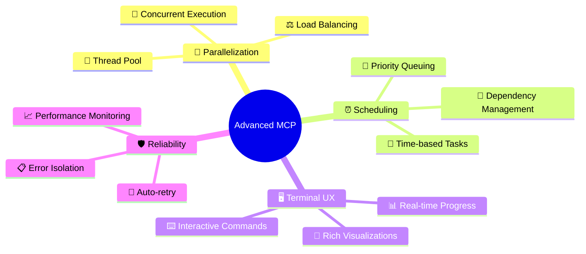
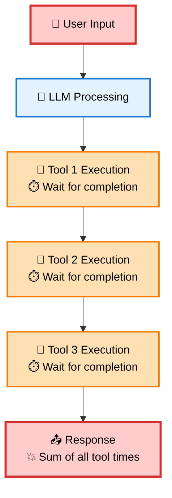
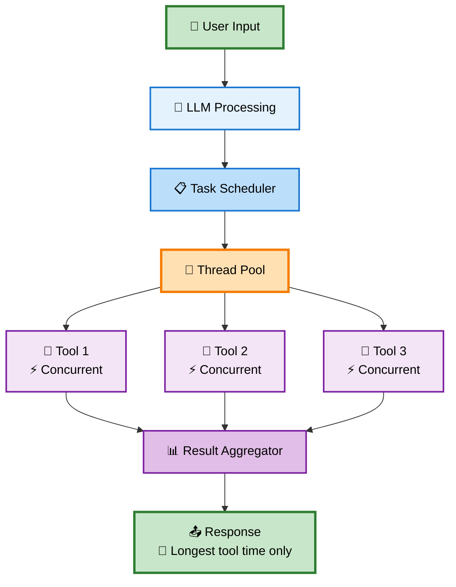
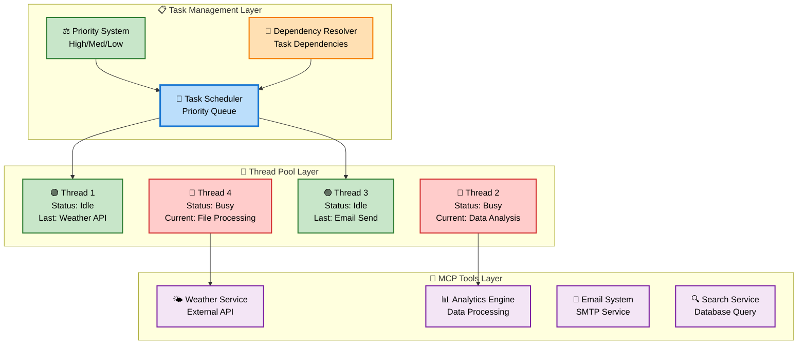
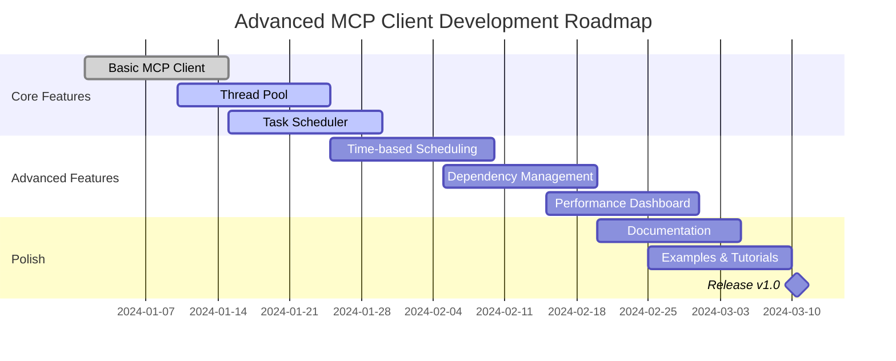

# 🚀 Advanced MCP Client

<div align="center">


**A next-generation Model Context Protocol client with parallelized tool execution and intelligent task scheduling**

[](https://www.typescriptlang.org/)
[](https://nodejs.org/)
[](LICENSE)
[](https://github.com/user/mcp-client)
[](https://github.com/user/mcp-client)

[📖 Documentation](#documentation) • [🎯 Features](#features) • [🏃 Quick Start](#quick-start) • [💡 Examples](#examples) • [🤝 Contributing](#contributing)

</div>

---

## 🌟 Why Advanced MCP Client?

Transform your MCP tool execution from **sequential bottlenecks** to **lightning-fast parallel processing**. Traditional clients waste time and resources by executing tools one-by-one, while our advanced client revolutionizes performance through intelligent concurrent execution.

### 🚀 **Performance Revolution**

<div align="center">

| Aspect | Traditional MCP | Advanced MCP | Key Advantage |
|--------|----------------|--------------|---------------|
| **Execution Model** | 🐌 Sequential | ⚡ Parallel | **Concurrent Processing** |
| **Resource Usage** | Single-threaded | Multi-threaded | **Full System Utilization** |
| **Responsiveness** | ❌ Blocking | ✅ Non-blocking | **Better User Experience** |
| **Scalability** | Limited | Configurable | **Adapts to Workload** |

</div>

**The fundamental difference:** While traditional clients execute tools sequentially (Tool 1 → Tool 2 → Tool 3), our advanced client dispatches all tools simultaneously across multiple threads, completing in the time of the slowest tool rather than the sum of all tools.

---

## 🎯 Features

### 🔥 Core Capabilities

<div align="center">

| Feature | Traditional MCP | Advanced MCP | Key Benefit |
|---------|----------------|--------------|-------------|
| **Tool Execution** | Sequential | Parallel | 🚀 **Concurrent Processing** |
| **Resource Usage** | Single-threaded | Multi-threaded | ⚡ **Better Utilization** |
| **Task Scheduling** | ❌ None | ✅ Time-based | 🎯 **Smart Orchestration** |
| **Error Recovery** | ❌ Blocking | ✅ Isolated | 🛡️ **Fault Tolerant** |
| **UI Responsiveness** | ❌ Frozen | ✅ Real-time | 💫 **Live Updates** |

</div>

### 🧠 Intelligent Features



### 🎨 Visual Terminal Interface

<details>
<summary><b>🖼️ Click to see the stunning terminal interface</b></summary>

<div style="background: linear-gradient(135deg, #1e1e2e 0%, #2d2d3a 100%); padding: 20px; border-radius: 12px; font-family: 'JetBrains Mono', 'Fira Code', 'Consolas', monospace; color: #cdd6f4; margin: 20px 0; box-shadow: 0 8px 32px rgba(0,0,0,0.3);">

<div style="background: linear-gradient(90deg, #89b4fa 0%, #cba6f7 100%); padding: 12px; border-radius: 8px; text-align: center; margin-bottom: 15px; color: #1e1e2e; font-weight: bold;">
🚀 Advanced MCP Client v2.0
</div>

<div style="display: flex; justify-content: space-between; background: rgba(116, 199, 236, 0.1); padding: 10px; border-radius: 6px; margin-bottom: 15px;">
<span>🔗 Connected: <span style="color: #a6e3a1;">3 servers</span></span>
<span>🧵 Threads: <span style="color: #f9e2af;">6/8 active</span></span>
<span>📋 Queue: <span style="color: #fab387;">2 tasks</span></span>
</div>

<div style="background: rgba(166, 227, 161, 0.1); border-left: 4px solid #a6e3a1; padding: 15px; margin: 15px 0; border-radius: 0 8px 8px 0;">
<div style="color: #a6e3a1; font-weight: bold; margin-bottom: 10px;">🎯 Active Tasks</div>
<div style="margin: 8px 0;"><span style="color: #89b4fa;">[#abc123]</span> 🔄 Weather Analysis <span style="float: right; color: #f38ba8;">Thread-2 | Running</span></div>
<div style="margin: 8px 0;"><span style="color: #89b4fa;">[#def456]</span> ⏳ Scheduled Report <span style="float: right; color: #fab387;">Scheduled | Pending</span></div>
<div style="margin: 8px 0;"><span style="color: #89b4fa;">[#ghi789]</span> 🎲 Data Processing <span style="float: right; color: #f38ba8;">Thread-4 | Running</span></div>
</div>

<div style="background: rgba(137, 180, 250, 0.1); border-left: 4px solid #89b4fa; padding: 15px; margin: 15px 0; border-radius: 0 8px 8px 0;">
<div style="color: #89b4fa; font-weight: bold; margin-bottom: 10px;">🔄 Parallel Tool Execution:</div>

<div style="margin: 10px 0;">
🌤️ Weather API
<div style="background: #313244; height: 20px; border-radius: 10px; margin: 5px 0; position: relative; overflow: hidden;">
<div style="background: linear-gradient(90deg, #a6e3a1, #94e2d5); height: 100%; width: 100%; border-radius: 10px;"></div>
<span style="position: absolute; top: 2px; right: 8px; font-size: 12px; color: #1e1e2e; font-weight: bold;">✅ Complete</span>
</div>
</div>

<div style="margin: 10px 0;">
📊 Data Analysis
<div style="background: #313244; height: 20px; border-radius: 10px; margin: 5px 0; position: relative; overflow: hidden;">
<div style="background: linear-gradient(90deg, #f9e2af, #fab387); height: 100%; width: 95%; border-radius: 10px;"></div>
<span style="position: absolute; top: 2px; right: 8px; font-size: 12px; color: #1e1e2e; font-weight: bold;">🔄 Running</span>
</div>
</div>

<div style="margin: 10px 0;">
📧 Email Service
<div style="background: #313244; height: 20px; border-radius: 10px; margin: 5px 0; position: relative; overflow: hidden;">
<div style="background: linear-gradient(90deg, #89b4fa, #cba6f7); height: 100%; width: 40%; border-radius: 10px;"></div>
<span style="position: absolute; top: 2px; right: 8px; font-size: 12px; color: #cdd6f4; font-weight: bold;">🔄 Running</span>
</div>
</div>

<div style="margin: 10px 0;">
🤖 AI Processing
<div style="background: #313244; height: 20px; border-radius: 10px; margin: 5px 0; position: relative; overflow: hidden;">
<div style="background: linear-gradient(90deg, #f38ba8, #eba0ac); height: 100%; width: 15%; border-radius: 10px;"></div>
<span style="position: absolute; top: 2px; right: 8px; font-size: 12px; color: #cdd6f4; font-weight: bold;">🔄 Starting</span>
</div>
</div>

<div style="margin-top: 15px; padding-top: 10px; border-top: 1px solid #45475a;">
<strong>Concurrent Execution:</strong>
<div style="background: #313244; height: 24px; border-radius: 12px; margin: 8px 0; position: relative; overflow: hidden;">
<div style="background: linear-gradient(90deg, #89b4fa, #cba6f7, #f38ba8); height: 100%; width: 60%; border-radius: 12px;"></div>
<span style="position: absolute; top: 5px; left: 12px; font-size: 12px; color: #1e1e2e; font-weight: bold;">Multiple tools running simultaneously</span>
</div>
</div>

</div>

<div style="margin-top: 15px; padding: 10px; background: rgba(69, 71, 90, 0.3); border-radius: 6px;">
<span style="color: #89b4fa;">❯</span> <span style="color: #cdd6f4;">_</span>
</div>

</div>

</details>

---

## 🏗️ Architecture Deep Dive

### 🔄 **Execution Flow Comparison**

<table>
<tr>
<td width="50%">

**🐌 Traditional Sequential Processing**


</td>
<td width="50%">

**⚡ Advanced Parallel Processing**


</td>
</tr>
</table>

### 🧵 **Thread Pool Architecture**



---

## 🏃 Quick Start

### 📦 Installation

```bash
# Clone the repository
git clone https://github.com/user/advanced-mcp-client.git
cd advanced-mcp-client

# Install dependencies
npm install

# Build the project
npm run build

# Start the client
npm start
```

### ⚡ Usage Patterns

**🖥️ Interactive Mode:**
- Real-time conversation with parallel tool execution
- Live status monitoring and task management
- Instant feedback and progress visualization

**⏰ Scheduled Operations:**
- Time-based task execution for automated workflows
- Priority-driven processing for critical operations
- Dependency management for complex multi-step processes

**🔧 Integration Scenarios:**
- Drop-in replacement for existing MCP clients
- Custom automation pipelines with scheduling
- High-throughput applications requiring parallel processing

### 🔧 Configuration

The client supports flexible configuration for different use cases:

- **🔗 Connection Management**: Multi-model LLM support with configurable endpoints
- **🧵 Thread Pool Control**: Adjustable concurrency limits and resource allocation  
- **⏰ Scheduling Options**: Time-based execution with priority queuing
- **🎨 Interface Preferences**: Customizable UI behavior and logging levels
- **🔧 Advanced Features**: Callback hooks and custom system prompts

---

## 🎯 Core Concepts

### 🔄 **Execution Philosophy**

Traditional MCP clients process tools sequentially, creating bottlenecks and poor resource utilization. Our advanced client transforms this by:

1. **🎯 Task Orchestration**: Grouping related tool calls into manageable execution units
2. **🧵 Parallel Processing**: Distributing work across multiple execution threads  
3. **⏰ Intelligent Scheduling**: Time-based and priority-driven task management
4. **📊 Real-time Monitoring**: Live feedback and progress tracking

### 🏗️ **System Architecture**

```
🔄 Core Loop:
   User Input → LLM Analysis → Task Creation → Parallel Execution → Aggregated Response

🧵 Thread Management:
   Task Scheduler → Thread Pool → Worker Distribution → Result Aggregation

⏰ Scheduling Engine:
   Priority Queue → Dependency Resolution → Time-based Execution → Status Tracking
```

### 🎨 **User Experience Design**

The terminal interface provides rich, real-time feedback without overwhelming the user:

- **📊 Live Progress**: Visual progress indicators for all running tasks
- **⚡ Instant Feedback**: Immediate response to user commands
- **🎛️ Interactive Control**: Runtime configuration and task management
- **📈 Performance Insights**: Built-in monitoring and optimization suggestions

---

## 💡 Use Cases

### 🌅 **Morning Routine Automation**

Transform sequential processing into parallel execution:

| Task | Traditional Approach | Parallel Approach |
|------|---------------------|-------------------|
| Weather Check | Execute first, wait for completion | Execute concurrently |
| Calendar Sync | Wait for weather, then execute | Execute concurrently |
| Email Summary | Wait for calendar, then execute | Execute concurrently |
| Stock Updates | Wait for email, then execute | Execute concurrently |
| **Result** | **Sequential bottleneck** | **🚀 Concurrent completion** |

### 🏢 **Business Intelligence Workflows**

**Daily Report Generation:**
- **⏰ Scheduled Execution**: Automatically run at 9 AM daily
- **📊 Data Aggregation**: Parallel collection from multiple sources
- **📈 Analysis Pipeline**: Dependency-managed processing steps
- **📧 Distribution**: Automated delivery to stakeholders

### 🔄 **API Integration Scenarios**

**Multi-Service Orchestration:**
- **🌐 External APIs**: Weather, calendar, CRM, analytics
- **🔀 Concurrent Requests**: Eliminate wait times between calls
- **🛡️ Error Isolation**: Failed services don't block others
- **⚡ Fast Recovery**: Automatic retry with exponential backoff

### 🎯 **Development Productivity**

**Seamless Migration:**
- **✅ Drop-in Replacement**: Same interface as basic MCP clients
- **🚀 Performance Boost**: Parallel execution without code changes
- **📊 Built-in Monitoring**: Real-time insights into execution patterns
- **🔧 Flexible Configuration**: Tune for your specific use case

### 🎮 **Interactive Management**

**Real-time Control:**
- **📊 System Monitoring**: Live status of threads, tasks, and performance
- **⏰ Task Scheduling**: Create, modify, and cancel scheduled operations  
- **🔧 Runtime Configuration**: Adjust settings without restart
- **📈 Performance Analytics**: Track efficiency and optimization opportunities
- **📋 History Tracking**: Review past executions and patterns

---

## 📊 Performance Benefits

### 🚀 **Parallel Execution Advantage**

The core performance benefit comes from **concurrent tool execution**:

- **Traditional**: Tools execute one after another (sequential)
- **Advanced**: Tools execute simultaneously (parallel)
- **Result**: Total time = longest individual tool time (not sum of all tools)

### 📈 **System Resource Utilization**

<div align="center">

| Aspect | Traditional | Advanced | Benefit |
|--------|-------------|----------|---------|
| **CPU Cores** | Single-threaded | Multi-threaded | Full system utilization |
| **Concurrency** | One tool at a time | Multiple tools simultaneously | Better resource efficiency |
| **I/O Operations** | Blocking | Non-blocking | Improved responsiveness |
| **Error Impact** | Cascading failures | Isolated failures | Better fault tolerance |

</div>

---

## 🛠️ Development

### 🏗️ **Modular Architecture**

The client is designed with clean separation of concerns:

- **🔧 Core Client**: MCP protocol handling and LLM integration
- **⏰ Task Scheduler**: Priority queues and time-based execution
- **🧵 Thread Pool**: Worker management and load distribution  
- **🎨 User Interface**: Terminal rendering and interaction handling
- **🔧 Utilities**: Shared functionality and helper modules

### 🧪 **Quality Assurance**

Comprehensive testing strategy ensures reliability:

- **🔄 Unit Testing**: Individual component verification
- **🔗 Integration Testing**: End-to-end workflow validation
- **⚡ Performance Testing**: Benchmarking and optimization
- **🛡️ Error Testing**: Fault tolerance and recovery scenarios

### 🔄 Development Status



**Current Status:**
- ✅ Basic MCP functionality
- ✅ Tool discovery & conversion
- ✅ Message array management
- ✅ Terminal UX design
- 🚧 Thread pool implementation (80%)
- 🚧 Task scheduling system (60%)
- ⏳ Time-based scheduling
- ⏳ Performance monitoring

---

## 🤝 Contributing

We welcome contributions! Here's how you can help:

### 🎯 Ways to Contribute

<div align="center">

| Type | Description | Difficulty |
|------|-------------|------------|
| 🐛 **Bug Reports** | Found an issue? Let us know! | 🟢 Easy |
| 📖 **Documentation** | Improve our docs | 🟢 Easy |
| ✨ **Features** | Add new capabilities | 🟡 Medium |
| 🔧 **Core Engine** | Thread pool & scheduling | 🔴 Hard |
| 🎨 **UI/UX** | Terminal interface | 🟡 Medium |

</div>

### 📋 Contribution Process

```mermaid
gitgraph
    commit id: "Fork Repo"
    branch feature
    checkout feature
    commit id: "Add Feature"
    commit id: "Add Tests"
    commit id: "Update Docs"
    checkout main
    merge feature
    commit id: "Release"
```

1. **🍴 Fork** the repository
2. **🌿 Create** a feature branch: `git checkout -b feature/amazing-feature`
3. **✨ Make** your changes with tests
4. **📝 Update** documentation
5. **🔍 Test** thoroughly: `npm test`
6. **📤 Submit** a pull request

### 🏆 Contributors

<div align="center">

Thanks to all our amazing contributors! 🎉

[](https://github.com/user/advanced-mcp-client/graphs/contributors)

</div>

---

## 📄 License & Support

<div align="center">

### 📝 License
This project is licensed under the **MIT License** - see the [LICENSE](LICENSE) file for details.

### 💬 Support & Community

[](https://discord.gg/mcp-client)
[](https://github.com/user/advanced-mcp-client/discussions)
[](https://docs.advanced-mcp-client.dev)

### 🎯 Project Status

**🚀 New Project - Just Getting Started!**

This is a brand new implementation that will revolutionize MCP client development. Star the repo to follow our progress and be part of the community that's building the future of parallel MCP execution!

</div>

---

<div align="center">

**🚀 Ready to supercharge your MCP experience?**

[Get Started Now](#quick-start) • [View Examples](#examples) • [Join Community](https://discord.gg/mcp-client)

---

*Made with ❤️ by the Advanced MCP Client team*

</div>