Excellent. I’ll expand the Advanced MCP Client documentation to include detailed architecture and implementation for:

- Persistent, thread-aware conversations
- Context compression/summarization systems
- CLI and secure web interface with remote continuation capabilities
- Advanced scheduling, scaling, monitoring, and security strategies

It will be formatted in clean, language-agnostic Markdown with clear contrast and professional Mermaid diagrams for architecture, flow, and thread management. I’ll let you know as soon as the polished version is ready.

# 🚀 Advanced MCP Client

<div align="center">


**A next-generation Model Context Protocol client with parallelized tool execution, intelligent task scheduling, and advanced context management**

[](https://www.typescriptlang.org/)
[](https://nodejs.org/)
[](LICENSE)
[](https://github.com/user/mcp-client)
[](https://github.com/user/mcp-client)

[📖 Documentation](#documentation) • [🎯 Features](#features) • [🏃 Quick Start](#quick-start) • [💡 Examples](#examples) • [🤝 Contributing](#contributing)

</div>

---

## 🌟 Why Advanced MCP Client?

Transform your MCP tool execution from **sequential bottlenecks** to **lightning-fast parallel processing**. Traditional clients waste time and resources by executing tools one-by-one, while our advanced client revolutionizes performance through intelligent concurrent execution.

### 🚀 **Performance Revolution**

<div align="center">

| Aspect              | Traditional MCP | Advanced MCP    | Key Advantage               |
| ------------------- | --------------- | --------------- | --------------------------- |
| **Execution Model** | 🐌 Sequential   | ⚡ Parallel     | **Concurrent Processing**   |
| **Resource Usage**  | Single-threaded | Multi-threaded  | **Full System Utilization** |
| **Responsiveness**  | ❌ Blocking     | ✅ Non-blocking | **Better User Experience**  |
| **Scalability**     | Limited         | Configurable    | **Adapts to Workload**      |

</div>

**The fundamental difference:** While traditional clients execute tools sequentially (Tool 1 → Tool 2 → Tool 3), our advanced client dispatches all tools simultaneously across multiple threads, completing in the time of the slowest tool rather than the sum of all tools.

---

## 🎯 Features

### 🔥 Core Capabilities

<div align="center">

| Feature                 | Traditional MCP     | Advanced MCP            | Key Benefit                  |
| ----------------------- | ------------------- | ----------------------- | ---------------------------- |
| **Tool Execution**      | Sequential          | Parallel                | 🚀 **Concurrent Processing** |
| **Resource Usage**      | Single-threaded     | Multi-threaded          | ⚡ **Better Utilization**    |
| **Task Scheduling**     | ❌ None             | ✅ Time-based           | 🎯 **Smart Orchestration**   |
| **Error Recovery**      | ❌ Blocking         | ✅ Isolated             | 🛡️ **Fault Tolerant**        |
| **UI Responsiveness**   | ❌ Frozen           | ✅ Real-time            | 💫 **Live Updates**          |
| **Conversation Memory** | Ephemeral (per run) | Persistent & Summarized | 📚 **Continuous Context**    |

</div>

### 🧠 Intelligent Features

```mermaid
mindmap
  root((Advanced MCP))
    🔄 Parallelization
      🧵 Thread Pool
      ⚖️ Load Balancing
      🔀 Concurrent Execution
    ⏰ Scheduling
      📅 Time-based Tasks
      🎯 Priority Queuing
      🔗 Dependency Management
    🖥️ Terminal UX
      📊 Real-time Progress
      🎨 Rich Visualizations
      ⌨️ Interactive Commands
    🛡️ Reliability
      🔄 Auto-retry
      📋 Error Isolation
      📈 Performance Monitoring
    💾 Context Management
      🗂️ Session Persistence
      🧵 Thread Isolation
      📝 Summarization
    🌐 Dual Interface
      ⌨️ CLI Mode
      🖥️ Web Mode
      🔒 Secure Sessions
```



### 🎨 Visual Terminal Interface

<details>
<summary><b>🖼️ Click to see the stunning terminal interface</b></summary>

<div style="background: linear-gradient(135deg, #1e1e2e 0%, #2d2d3a 100%); padding: 20px; border-radius: 12px; font-family: 'JetBrains Mono', 'Fira Code', 'Consolas', monospace; color: #cdd6f4; margin: 20px 0; box-shadow: 0 8px 32px rgba(0,0,0,0.3);">

<div style="background: linear-gradient(90deg, #89b4fa 0%, #cba6f7 100%); padding: 12px; border-radius: 8px; text-align: center; margin-bottom: 15px; color: #1e1e2e; font-weight: bold;">
🚀 Advanced MCP Client v2.0
</div>

<div style="display: flex; justify-content: space-between; background: rgba(116, 199, 236, 0.1); padding: 10px; border-radius: 6px; margin-bottom: 15px;">
<span>🔗 Connected: <span style="color: #a6e3a1;">3 servers</span></span>
<span>🧵 Threads: <span style="color: #f9e2af;">6/8 active</span></span>
<span>📋 Queue: <span style="color: #fab387;">2 tasks</span></span>
</div>

<div style="background: rgba(166, 227, 161, 0.1); border-left: 4px solid #a6e3a1; padding: 15px; margin: 15px 0; border-radius: 0 8px 8px 0;">
<div style="color: #a6e3a1; font-weight: bold; margin-bottom: 10px;">🎯 Active Tasks</div>
<div style="margin: 8px 0;"><span style="color: #89b4fa;">[#abc123]</span> 🔄 Weather Analysis <span style="float: right; color: #f38ba8;">Thread-2 | Running</span></div>
<div style="margin: 8px 0;"><span style="color: #89b4fa;">[#def456]</span> ⏳ Scheduled Report <span style="float: right; color: #fab387;">Scheduled | Pending</span></div>
<div style="margin: 8px 0;"><span style="color: #89b4fa;">[#ghi789]</span> 🎲 Data Processing <span style="float: right; color: #f38ba8;">Thread-4 | Running</span></div>
</div>

<div style="background: rgba(137, 180, 250, 0.1); border-left: 4px solid #89b4fa; padding: 15px; margin: 15px 0; border-radius: 0 8px 8px 0;">
<div style="color: #89b4fa; font-weight: bold; margin-bottom: 10px;">🔄 Parallel Tool Execution:</div>

<div style="margin: 10px 0;">
🌤️ Weather API
<div style="background: #313244; height: 20px; border-radius: 10px; margin: 5px 0; position: relative; overflow: hidden;">
<div style="background: linear-gradient(90deg, #a6e3a1, #94e2d5); height: 100%; width: 100%; border-radius: 10px;"></div>
<span style="position: absolute; top: 2px; right: 8px; font-size: 12px; color: #1e1e2e; font-weight: bold;">✅ Complete</span>
</div>
</div>

<div style="margin: 10px 0;">
📊 Data Analysis
<div style="background: #313244; height: 20px; border-radius: 10px; margin: 5px 0; position: relative; overflow: hidden;">
<div style="background: linear-gradient(90deg, #f9e2af, #fab387); height: 100%; width: 95%; border-radius: 10px;"></div>
<span style="position: absolute; top: 2px; right: 8px; font-size: 12px; color: #1e1e2e; font-weight: bold;">🔄 Running</span>
</div>
</div>

<div style="margin: 10px 0;">
📧 Email Service
<div style="background: #313244; height: 20px; border-radius: 10px; margin: 5px 0; position: relative; overflow: hidden;">
<div style="background: linear-gradient(90deg, #89b4fa, #cba6f7); height: 100%; width: 40%; border-radius: 10px;"></div>
<span style="position: absolute; top: 2px; right: 8px; font-size: 12px; color: #cdd6f4; font-weight: bold;">🔄 Running</span>
</div>
</div>

<div style="margin: 10px 0;">
🤖 AI Processing
<div style="background: #313244; height: 20px; border-radius: 10px; margin: 5px 0; position: relative; overflow: hidden;">
<div style="background: linear-gradient(90deg, #f38ba8, #eba0ac); height: 100%; width: 15%; border-radius: 10px;"></div>
<span style="position: absolute; top: 2px; right: 8px; font-size: 12px; color: #cdd6f4; font-weight: bold;">🔄 Starting</span>
</div>
</div>

<div style="margin-top: 15px; padding-top: 10px; border-top: 1px solid #45475a;">
<strong>Concurrent Execution:</strong>
<div style="background: #313244; height: 24px; border-radius: 12px; margin: 8px 0; position: relative; overflow: hidden;">
<div style="background: linear-gradient(90deg, #89b4fa, #cba6f7, #f38ba8); height: 100%; width: 60%; border-radius: 12px;"></div>
<span style="position: absolute; top: 5px; left: 12px; font-size: 12px; color: #1e1e2e; font-weight: bold;">Multiple tools running simultaneously</span>
</div>
</div>

</div>

<div style="margin-top: 15px; padding: 10px; background: rgba(69, 71, 90, 0.3); border-radius: 6px;">
<span style="color: #89b4fa;">❯</span> <span style="color: #cdd6f4;">_</span>
</div>

</div>

</details>

### 💾 Contextual Memory & Summarization

- **Session Persistence**: Each conversation thread retains its own history in isolation, preserving context across interactions. The client stores this context in-memory by default and can optionally persist it to disk or a database for long-term memory.
- **Thread-Aware Isolation**: Context is maintained separately per thread, so multiple parallel conversations or tasks do not interfere with each other's data. This ensures each thread's responses are relevant only to its unique conversation.
- **Context Summarization**: For extended sessions, the client intelligently compresses or summarizes older conversation turns using LLM-based techniques. This reduces context size and keeps prompts within the LLM's token limit. Older messages are distilled into succinct summaries ("key frames") to maintain important information while discarding low-level details.
- **Adaptive History Pruning**: The system employs a sliding "memory window" – keeping the most recent messages verbatim and trimming or summarizing older history when it grows too large. This ensures the active context stays focused and relevant. Users can configure retention policies or snapshot intervals for conversation history.

### 🌐 Dual Interface (CLI & Web)

- **CLI-First Design**: The advanced client is primarily a command-line tool, offering a rich terminal UI experience. Users get all features (parallel execution, scheduling, context management) directly in the CLI environment.
- **Optional Web Frontend**: For added flexibility, a web-based interface is available. This browser dashboard provides real-time monitoring and control of conversations and tasks, mirroring the CLI's functionality with a graphical UI.
- **Seamless Session Handoff**: Users can start a conversation on the CLI and continue it on the web interface (or vice versa) without losing context. A secure session token or login links the two, allowing the backend to load the correct conversation state when switching interfaces.
- **Secure Access**: All remote interactions require authentication. Conversation data can be encrypted during transit between the CLI, web interface, and backend server, ensuring privacy and integrity when using the web UI.

---

## 🏗️ Architecture Deep Dive

### 🔄 **Execution Flow Comparison**

<table>
<tr>
<td width="50%">

**🐌 Traditional Sequential Processing**

```mermaid
graph TD
    A1[🔵 User Input] --> B1[🤖 LLM Processing]
    B1 --> C1[🔧 Tool 1 Execution<br/>⏱️ Wait for completion]
    C1 --> D1[🔧 Tool 2 Execution<br/>⏱️ Wait for completion]
    D1 --> E1[🔧 Tool 3 Execution<br/>⏱️ Wait for completion]
    E1 --> F1[📤 Response<br/>💥 Sum of all tool times]

    style A1 fill:#ffcccb,stroke:#d32f2f,stroke-width:3px,color:#000
    style F1 fill:#ffcccb,stroke:#d32f2f,stroke-width:3px,color:#000
    style C1 fill:#ffe0b3,stroke:#f57c00,stroke-width:2px,color:#000
    style D1 fill:#ffe0b3,stroke:#f57c00,stroke-width:2px,color:#000
    style E1 fill:#ffe0b3,stroke:#f57c00,stroke-width:2px,color:#000
    style B1 fill:#e3f2fd,stroke:#1976d2,stroke-width:2px,color:#000
```



</td>
<td width="50%">

**⚡ Advanced Parallel Processing**

```mermaid
graph TD
    A2[🔵 User Input] --> B2[🤖 LLM Processing]
    B2 --> C2[📋 Task Scheduler]
    C2 --> D2[🧵 Thread Pool]

    D2 --> E2[🔧 Tool 1<br/>⚡ Concurrent]
    D2 --> F2[🔧 Tool 2<br/>⚡ Concurrent]
    D2 --> G2[🔧 Tool 3<br/>⚡ Concurrent]

    E2 --> H2[📊 Result Aggregator]
    F2 --> H2
    G2 --> H2
    H2 --> I2[📤 Response<br/>🚀 Longest tool time only]

    style A2 fill:#c8e6c9,stroke:#2e7d32,stroke-width:3px,color:#000
    style I2 fill:#c8e6c9,stroke:#2e7d32,stroke-width:3px,color:#000
    style D2 fill:#ffe0b3,stroke:#f57c00,stroke-width:3px,color:#000
    style C2 fill:#bbdefb,stroke:#1976d2,stroke-width:2px,color:#000
    style H2 fill:#e1bee7,stroke:#7b1fa2,stroke-width:2px,color:#000
    style B2 fill:#e3f2fd,stroke:#1976d2,stroke-width:2px,color:#000
    style E2 fill:#f3e5f5,stroke:#7b1fa2,stroke-width:2px,color:#000
    style F2 fill:#f3e5f5,stroke:#7b1fa2,stroke-width:2px,color:#000
    style G2 fill:#f3e5f5,stroke:#7b1fa2,stroke-width:2px,color:#000
```



</td>
</tr>
</table>

### 🧵 **Thread Pool Architecture**

```mermaid
graph TB
    subgraph TML["📋 Task Management Layer"]
        TS[🎯 Task Scheduler<br/>Priority Queue]
        PS[⚖️ Priority System<br/>High/Med/Low]
        DS[🔗 Dependency Resolver<br/>Task Dependencies]
    end

    subgraph TPL["🧵 Thread Pool Layer"]
        T1[🟢 Thread 1<br/>Status: Idle<br/>Last: Weather API]
        T2[🔴 Thread 2<br/>Status: Busy<br/>Current: Data Analysis]
        T3[🟢 Thread 3<br/>Status: Idle<br/>Last: Email Send]
        T4[🔴 Thread 4<br/>Status: Busy<br/>Current: File Processing]
    end

    subgraph MTL["🔧 MCP Tools Layer"]
        MT1[🌤️ Weather Service<br/>External API]
        MT2[📊 Analytics Engine<br/>Data Processing]
        MT3[📧 Email System<br/>SMTP Service]
        MT4[🔍 Search Service<br/>Database Query]
    end

    TS --> T1
    TS --> T3
    PS --> TS
    DS --> TS

    T2 --> MT2
    T4 --> MT1

    style TS fill:#bbdefb,stroke:#1976d2,stroke-width:3px,color:#000
    style PS fill:#c8e6c9,stroke:#2e7d32,stroke-width:2px,color:#000
    style DS fill:#ffe0b3,stroke:#f57c00,stroke-width:2px,color:#000
    style T1 fill:#c8e6c9,stroke:#2e7d32,stroke-width:2px,color:#000
    style T2 fill:#ffcccb,stroke:#d32f2f,stroke-width:2px,color:#000
    style T3 fill:#c8e6c9,stroke:#2e7d32,stroke-width:2px,color:#000
    style T4 fill:#ffcccb,stroke:#d32f2f,stroke-width:2px,color:#000
    style MT1 fill:#f3e5f5,stroke:#7b1fa2,stroke-width:2px,color:#000
    style MT2 fill:#f3e5f5,stroke:#7b1fa2,stroke-width:2px,color:#000
    style MT3 fill:#f3e5f5,stroke:#7b1fa2,stroke-width:2px,color:#000
    style MT4 fill:#f3e5f5,stroke:#7b1fa2,stroke-width:2px,color:#000
```



### 💾 **Session & Context Management**

Persistent context is managed through a **Session Manager** component that isolates conversation data per session (or thread). Each user session (or conversation thread) is assigned a unique identifier to scope its conversation history:

- **Per-Session Isolation**: The Session Manager ensures that each thread's conversation context (prompt history, tool outputs, etc.) is kept separate from others. This allows concurrent threads to maintain independent dialogues without cross-talk.
- **Context Store**: Session data can be stored in-memory for fast access. Optionally, a persistent store (like a database or file system) can be used to save conversations, enabling context restoration after restarts or across different interfaces.
- **Context Restoration**: When a session is resumed (either in the CLI or via the web UI), the Session Manager reloads the conversation history from storage. The assistant "remembers" previous interactions even if the interface or runtime has changed, providing continuity across sessions.
- **Summarization Workflow**: If a session's history becomes very long, the system triggers a summarization step to condense older exchanges. A dedicated Summarizer module (leveraging an LLM) generates a synopsis of earlier dialogue, which replaces or archives the verbose content. The summary is then used in future prompts so that essential context is preserved within the LLM's token window.

```mermaid
sequenceDiagram
    participant U as 🧑 User
    participant SM as 💾 Session Manager
    participant SUM as 📝 Summarizer (LLM)
    participant LLM as 🤖 LLM Engine
    U->>SM: New message (with session ID)
    SM->>SM: **Load** conversation history by session ID
    alt **If context too large**
        SM-->>SUM: Summarize oldest messages
        SUM-->>SM: Summary of old interactions
        SM->>SM: **Replace** old history with summary
    end
    SM-->>LLM: Send context + user query
    LLM-->>SM: Response (answer or tool requests)
    SM->>SM: Append user query & assistant response to store
    SM-->>U: Return AI response to user
    SM->>SM: **Persist** updated session history
```



_In this flow, the Session Manager fetches the relevant history for a session, trims it via summarization if needed, and includes it when invoking the LLM. After generating a response (and executing any required tools), the conversation state is updated and saved._

### 🌐 **Dual Interface Architecture**

The Advanced MCP Client can operate in both standalone CLI mode and as a networked server supporting a web frontend. The architecture allows both interfaces to access the core engine seamlessly:

- **Unified Backend**: A single backend engine handles requests from both CLI and web clients. It houses the LLM integration, task scheduler, thread pool, and context manager.
- **Client Connections**: The CLI can run in a local mode (directly using the backend in-process) or connect to a remote server. The web interface communicates with the backend over secure HTTP/WebSocket calls. Both interfaces use the same API endpoints, ensuring feature parity.
- **Session Identification**: Each conversation is identified by a session ID or token. The server uses this to route requests to the correct context. For example, a user logged in via the web with session "ABC123" will share that session’s context if they reconnect via CLI using the same token.
- **Concurrent Sessions**: The backend can handle multiple sessions from multiple users simultaneously. The Session Manager isolates each session, and the Thread Pool + Scheduler manage tasks across sessions without interference, enabling true multi-user concurrency.


_In the above diagram: CLI and Web clients communicate with the same backend. The Auth service handles authentication and session tokens. The Session Manager fetches and updates conversation state (using an in-memory or persistent Context Store). All incoming requests (regardless of interface) flow through the Task Scheduler and Thread Pool for execution. The Summarizer service can be invoked by the Session Manager as needed to compress conversation history. External tool calls are executed via the Thread Pool, and results are integrated into the session before responding back to the client._

---

## 🏃 Quick Start

### 📦 Installation

```bash
# Clone the repository
git clone https://github.com/user/advanced-mcp-client.git
cd advanced-mcp-client

# Install dependencies
npm install

# Build the project
npm run build

# Start the client (CLI mode)
npm start
```

### ⚡ Usage Patterns

**🖥️ Interactive Mode:**

- Real-time conversation with parallel tool execution
- Live status monitoring and task management
- Instant feedback and progress visualization

**⏰ Scheduled Operations:**

- Time-based task execution for automated workflows
- Priority-driven processing for critical operations
- Dependency management for complex multi-step processes

**🔧 Integration Scenarios:**

- Drop-in replacement for existing MCP clients
- Custom automation pipelines with scheduling and concurrency
- High-throughput applications requiring parallel processing and long-lived sessions

### 🔧 Configuration

The client supports flexible configuration for different use cases:

- **🔗 Connection Management**: Multi-model LLM support with configurable endpoints (local or remote models)
- **🧵 Thread Pool Control**: Adjustable concurrency limits and resource allocation
- **⏰ Scheduling Options**: Time-based execution schedules with priority queues
- **🎨 Interface Preferences**: Customizable UI behavior, logging levels, and optional web dashboard
- **🔧 Advanced Features**: Callback hooks, custom system prompts, and session persistence toggles

---

## 🎯 Core Concepts

### 🔄 **Execution Philosophy**

Traditional MCP clients process tools sequentially, creating bottlenecks and poor resource utilization. Our advanced client transforms this by:

1. **🎯 Task Orchestration**: Grouping related tool calls into manageable execution units.
2. **🧵 Parallel Processing**: Distributing work across multiple execution threads.
3. **⏰ Intelligent Scheduling**: Time-based and priority-driven task management.
4. **📊 Real-time Monitoring**: Live feedback and progress tracking of tasks.
5. **💾 Persistent Context**: Maintaining conversation state across interactions and sessions for continuity.

### 🏗️ **System Architecture**

```
🔄 Core Loop:
   User Input → LLM Analysis → Task Creation → Parallel Execution → Aggregated Response

🧵 Thread Management:
   Task Scheduler → Thread Pool → Concurrent Workers → Result Aggregation

⏰ Scheduling Engine:
   Priority Queue → Dependency Resolution → Time-based Execution → Status Tracking

💾 Context Engine:
   Session Isolation → Persistent Store → Summarization → Context Restoration
```

### 🎨 **User Experience Design**

The terminal interface provides rich, real-time feedback without overwhelming the user:

- **📊 Live Progress**: Visual progress indicators for all running tasks.
- **⚡ Instant Feedback**: Immediate responses to user commands, even while tools run.
- **🎛️ Interactive Control**: Runtime configuration and task management (pause or cancel tasks).
- **📈 Performance Insights**: Built-in monitoring displays and optimization suggestions.
- **🌐 Web Dashboard**: _(Optional)_ Graphical view of sessions, tasks, and metrics via the web interface.

---

## 💡 Use Cases

### 🌅 **Morning Routine Automation**

Transform sequential processing into parallel execution:

| Task          | Traditional Approach               | Parallel Approach            |
| ------------- | ---------------------------------- | ---------------------------- |
| Weather Check | Execute first, wait for completion | Execute concurrently         |
| Calendar Sync | Wait for weather, then execute     | Execute concurrently         |
| Email Summary | Wait for calendar, then execute    | Execute concurrently         |
| Stock Updates | Wait for email, then execute       | Execute concurrently         |
| **Result**    | **Sequential bottleneck**          | **🚀 Concurrent completion** |

### 🏢 **Business Intelligence Workflows**

**Daily Report Generation:**

- **⏰ Scheduled Execution**: Automatically run at 9 AM daily.
- **📊 Data Aggregation**: Parallel collection from multiple sources.
- **📈 Analysis Pipeline**: Dependency-managed processing steps executed in order.
- **📧 Distribution**: Automated report compilation and email delivery to stakeholders.

### 🔄 **API Integration Scenarios**

**Multi-Service Orchestration:**

- **🌐 External APIs**: Weather, calendar, CRM, analytics services integrated.
- **🔀 Concurrent Requests**: Eliminate idle time by calling multiple APIs in parallel.
- **🛡️ Error Isolation**: Failures in one service do not block others.
- **⚡ Fast Recovery**: Automatic retries with exponential backoff for transient errors.

### 🎯 **Development Productivity**

**Seamless Migration:**

- **✅ Drop-in Replacement**: Same interface as basic MCP clients for easy adoption.
- **🚀 Performance Boost**: Parallel execution and caching without code changes.
- **📊 Built-in Monitoring**: Real-time insights into execution patterns and resource usage.
- **🔧 Flexible Configuration**: Tune thread count, scheduling, and context settings for your use case.

### 🎮 **Interactive Management**

**Real-time Control:**

- **📊 System Monitoring**: Live status of threads, tasks, and performance metrics.
- **⏰ Task Scheduling**: Create, modify, and cancel scheduled operations on the fly.
- **🔧 Runtime Configuration**: Adjust settings (e.g., concurrency, logging) without restart.
- **📈 Performance Analytics**: Track efficiency, identify bottlenecks, and get optimization tips.
- **📋 History Tracking**: Review past executions and conversation threads for audit and analysis.

---

## 📊 Performance Benefits

### 🚀 **Parallel Execution Advantage**

The core performance benefit comes from **concurrent tool execution**:

- **Traditional**: Tools execute one after another (sequentially).
- **Advanced**: Tools execute simultaneously (in parallel).
- **Result**: Total completion time ≈ longest individual tool time (instead of the sum of all tools).

### 📈 **System Resource Utilization**

<div align="center">

| Aspect             | Traditional        | Advanced                      | Benefit                    |
| ------------------ | ------------------ | ----------------------------- | -------------------------- |
| **CPU Cores**      | Single-threaded    | Multi-threaded                | Full system utilization    |
| **Concurrency**    | One tool at a time | Multiple tools simultaneously | Better resource efficiency |
| **I/O Operations** | Blocking           | Non-blocking                  | Improved responsiveness    |
| **Error Impact**   | Cascading failures | Isolated failures             | Better fault tolerance     |

</div>

---

## 🛠️ Development

### 🏗️ **Modular Architecture**

The client is designed with a clean separation of concerns:

- **🔧 Core Client**: MCP protocol handling and LLM integration logic.
- **⏰ Task Scheduler**: Priority queue and timing for task execution.
- **🧵 Thread Pool**: Worker management and load distribution for parallel tasks.
- **🎨 User Interface**: Terminal and web UI rendering, input handling.
- **💾 Context Manager**: Session context tracking, persistence, and summarization of conversation history.
- **🔒 Session/Auth Service**: User authentication and session token management for secure web access.
- **🔧 Utilities**: Shared functionality, helper classes, and integration hooks.

### 🔧 **Implementation Blueprint**

While the architecture outlines the components, the implementation can be approached in a modular, language-agnostic way. Below is pseudocode illustrating key subsystems of the advanced client:

**Session and Task Handling (Pseudocode):**

```plaintext
# In-memory store for session contexts
sessionStore = {}  # e.g., { sessionId: [conversation_history] }

# Retrieve or create a session context for a given session ID
function getSessionContext(sessionId):
    if sessionId in sessionStore:
        return sessionStore[sessionId]
    else:
        sessionStore[sessionId] = []
        return sessionStore[sessionId]

# Handle a new user message within a session
function handleMessage(sessionId, userMessage):
    context = getSessionContext(sessionId)          # Load existing conversation history
    # Ensure context length within LLM capacity
    if tokens(context + [userMessage]) > MAX_TOKENS:
        summary = LLM.summarize(context)            # Summarize old history using LLM
        context = [summary] + lastMessages(context) # Replace old history with summary
    # LLM processes message in context (may return direct answer or tool invocation plan)
    result = LLM.process(userMessage, context)
    if result.requiresTools:
        tasks = result.extractTasks()               # Parse tool invocations from LLM output
        scheduleTasks(tasks)                        # Hand off tasks to scheduler for parallel execution
        toolOutputs = waitForAll(tasks)             # Wait for thread pool to complete all tasks
        finalAnswer = LLM.process(toolOutputs, context)  # Optionally use LLM to integrate tool outputs
    else:
        finalAnswer = result.answer
    append(context, userMessage, finalAnswer)       # Update session context with the Q&A
    return finalAnswer

# Schedule tasks for parallel execution
function scheduleTasks(taskList):
    for task in taskList:
        threadPool.assign(task)                     # Uses internal logic for load balancing & priority
    # ThreadPool will run tasks asynchronously and handle their completion events
```

_(The above pseudocode illustrates how session context and tool tasks might be handled. Actual implementation will vary by language — e.g., using async/await or thread primitives — but the logical flow remains the same.)_

**Dual Interface Handling**:

- The system can run entirely locally (CLI mode) or in a client-server setup. In server mode, a separate web service layer listens for browser requests.
- When running as a server, the application issues a unique session token upon user authentication. This token ties the user's web session to a backend session context.
- The CLI can operate in offline mode (managing context locally) or connect to the server with a provided token. In connected mode, CLI commands are sent to the server, which calls `handleMessage(sessionId, message)` and returns results back to the CLI.
- **Language Agnostic Design**: The above patterns can be implemented in any modern language. For example, one might use Python's `asyncio` or Node.js worker threads for parallelism. The key is using concurrency primitives (threads, async tasks, message queues) and a persistent storage mechanism (in-memory structures, Redis or SQL for distributed scenarios) to achieve the described behavior.

### 🧪 **Quality Assurance**

Comprehensive testing ensures reliability:

- **🔄 Unit Testing**: Individual components (scheduler, thread pool, context manager, etc.) are tested in isolation.
- **🔗 Integration Testing**: End-to-end workflows are validated (e.g., a full conversation with tool calls and context switching).
- **⚡ Performance Testing**: Stress tests and benchmarks ensure the system handles high concurrency and long conversations without degradation.
- **🛡️ Error Testing**: Fault injection and recovery scenarios (network failures, tool timeouts, etc.) are simulated to verify resilience.

### 🔄 **Development Status**


**Current Status:**

- ✅ Basic MCP functionality implemented
- ✅ Tool discovery & conversion logic
- ✅ Message array (prompt history) management
- ✅ Terminal UI/UX design
- ✅ Thread pool and parallel execution engine
- ✅ Task scheduling system (time-based and priority)
- ⏳ Persistent session memory (in progress)
- ⏳ Conversation summarization engine (in progress)
- ⏳ Web interface integration (beta testing)

---

## 🏭 Scalability, Monitoring & Security

### 🚀 Scalability

- **Horizontal Scaling**: Deploy multiple instances of the MCP backend across servers or containers. Use a load balancer to distribute user sessions among instances. A shared context store (e.g. a cloud database) allows any instance to retrieve conversation state, so sessions can continue seamlessly even if handled by different nodes.
- **Multi-User Concurrency**: The architecture supports multiple simultaneous users, each with isolated sessions. The thread pool and scheduler handle tasks from different users without interference. For heavy workloads, the system can spawn additional worker threads or processes as configured, or use a distributed task queue to scale beyond a single machine.
- **Resource Management**: Configurable thread pools and task queues allow tuning for CPU-bound vs. I/O-bound workloads. The client can adjust concurrency based on system resources (e.g., more threads on multi-core servers) or throttle parallelism on limited hardware to avoid overload. Backpressure mechanisms (pausing new tasks when the queue is full) ensure stability under high load.

### 📈 Monitoring & Observability

- **Real-Time Dashboard**: A built-in dashboard (in the web UI or a dedicated monitoring tool) displays live metrics: active threads, queue lengths, CPU/memory usage, response times, etc. This provides immediate insight into system performance and helps identify bottlenecks at a glance.
- **Logging & Metrics**: The client logs key events (task start/completion, errors, retries) with timestamps and context. It can integrate with monitoring stacks (e.g. Prometheus/Grafana) by exposing metrics like throughput, task duration, and token consumption. Alerts can be configured for abnormal conditions (e.g., repeated failures or high latency).
- **Historical Analytics**: Execution data can be persisted for offline analysis. This allows generation of reports on usage patterns (peak hours, popular tools, longest-running tasks) and helps in capacity planning. Over time, such analytics inform tuning of thread pool sizes, scheduling priorities, and context window strategies.

### 🔒 Security

- **Authentication & Authorization**: All web requests require a valid login or API token. Session tokens are signed and short-lived to prevent hijacking. Role-based access control can restrict sensitive operations (like administrative commands or certain tools) to authorized users.
- **Encryption**: Communication between clients (CLI or web) and the server is secured via HTTPS (TLS). If a database or external store is used for context data, that data can be encrypted at rest. Additionally, any API keys or credentials for external services are stored securely on the server (never exposed in client-side code or logs).
- **Rate Limiting**: To prevent abuse, the server enforces rate limits on user requests and tool invocations. For example, a user might be limited to N queries per minute. This ensures no single user can overwhelm the system with excessive parallel tasks or API calls.
- **Session Validation & Privacy**: The backend validates that each request’s session ID or token matches an active session for the authenticated user. Conversation data for different users is strictly isolated. Users cannot access others’ conversation histories. Regular audits and optional auto-purging of old sessions help maintain privacy and minimize data retention risks.

---

## 🤝 Contributing

### 🎯 Ways to Contribute

<div align="center">

| Type                 | Description                            | Difficulty |
| -------------------- | -------------------------------------- | ---------- |
| 🐛 **Bug Reports**   | Found an issue? Let us know!           | 🟢 Easy    |
| 📖 **Documentation** | Improve our docs                       | 🟢 Easy    |
| ✨ **Features**      | Add new capabilities                   | 🟡 Medium  |
| 🔧 **Core Engine**   | Thread pool & scheduling internals     | 🔴 Hard    |
| 🎨 **UI/UX**         | Terminal or web interface improvements | 🟡 Medium  |

</div>

### 📋 Contribution Process

```mermaid
gitgraph
    commit id: "Fork Repo"
    branch feature
    checkout feature
    commit id: "Add Feature"
    commit id: "Add Tests"
    commit id: "Update Docs"
    checkout main
    merge feature
    commit id: "Release"
```

1. **🍴 Fork** the repository
2. **🌿 Create** a feature branch: `git checkout -b feature/amazing-feature`
3. **✨ Make** your changes (with tests)
4. **📝 Update** documentation accordingly
5. **🔍 Test** thoroughly (`npm test`)
6. **📤 Submit** a pull request for review

### 🏆 Contributors

<div align="center">

Thanks to all our amazing contributors! 🎉

[](https://github.com/user/advanced-mcp-client/graphs/contributors)

</div>

---

## 📄 License & Support

<div align="center">

### 📝 License

This project is licensed under the **MIT License** - see the [LICENSE](LICENSE) file for details.

### 💬 Support & Community

[](https://discord.gg/mcp-client)
[](https://github.com/user/advanced-mcp-client/discussions)
[](https://docs.advanced-mcp-client.dev)

### 🎯 Project Status

**🚀 New Project - Just Getting Started!**

This is a brand new implementation that will revolutionize MCP client development. Star the repo to follow our progress and be part of the community that's building the future of parallel MCP execution!

</div>

---

<div align="center">

**🚀 Ready to supercharge your MCP experience?**

[Get Started Now](#quick-start) • [View Examples](#examples) • [Join Community](https://discord.gg/mcp-client)

---

_Made with ❤️ by the Advanced MCP Client team_

</div>
